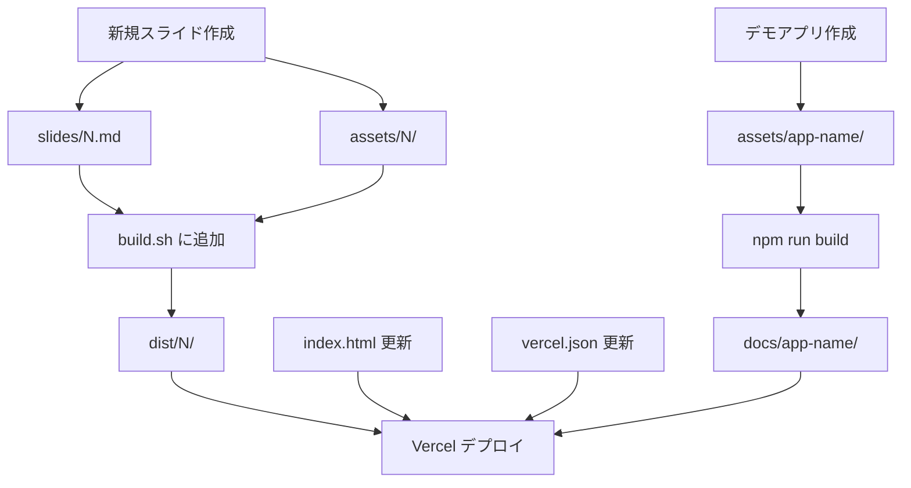

# Design Document: 新規レッスンスライド追加

## Overview

このドキュメントは，新しいレッスン用スライドを追加する際の設計詳細を定義します．Slidev を使用した Markdown ベースのスライド作成，静的アセットの管理，ビルドプロセスへの統合，およびオプションでのデモアプリケーション追加に関する技術的な実装方法を記載します．

## Steering Document Alignment

### Technical Standards (tech.md)
- **Slidev 52.1.0** を使用した Markdown ベースのスライド作成
- **Node.js 24.0.1 (Volta 管理)** による環境統一
- **pnpm 9.12.2** によるパッケージ管理
- **Vite** による高速ビルド（デモアプリ）
- **Vercel** による自動デプロイ

### Project Structure (structure.md)
- スライドファイルは `slides/[N].md` に配置
- 静的アセットは `assets/[N]/` に配置
- デモアプリは `assets/[app-name]/` に配置
- ビルド出力は `dist/[N]/` と `docs/[app-name]/` に分離
- `CLAUDE.md` のコーディング規約に従う

## Code Reuse Analysis

### Existing Components to Leverage
- **既存のスライドテンプレート**: `slides/1.md`, `slides/4.md` などを参考に frontmatter とレイアウト構造を再利用
- **共通スタイル**: `styles/styles.css` を全スライドで共有
- **ビルドスクリプト**: `build.sh` の既存パターンを踏襲

### Integration Points
- **index.html**: 新規レッスンへのリンクを追加
- **build.sh**: 新規スライドのビルドコマンドを追加
- **vercel.json**: 新規レッスン用のリダイレクト設定を追加

## Architecture

### Modular Design Principles
- **Single File Responsibility**: 各スライドファイルは1つのレッスンに集中
- **Component Isolation**: デモアプリは独立したディレクトリで管理
- **Service Layer Separation**: スライド（コンテンツ），アセット（静的リソース），デモアプリ（実行可能コード）を分離
- **Utility Modularity**: 共通スタイルとビルドスクリプトを再利用



## Components and Interfaces

### Component 1: スライドファイル (`slides/[N].md`)

- **Purpose:** レッスン内容を Markdown 形式で記述し，Slidev でビルド
- **Interfaces:**
  - Frontmatter（メタデータ）
  - Markdown コンテンツ（スライド本体）
  - Slidev 特有の記法（`---` による区切り，`layout` 指定，`<v-clicks>` など）
- **Dependencies:**
  - Slidev CLI
  - Slidev テーマ（seriph, apple-basic, bricks など）
  - 静的アセット（`assets/[N]/`）
- **Reuses:**
  - 既存スライドの frontmatter 構造
  - 共通スタイル（`styles/styles.css`）
  - CLAUDE.md のスライド作成ルール

**スライドファイル構造:**

```markdown
---
theme: seriph
background: https://picsum.photos/1920/1080
class: text-center
highlighter: shiki
lineNumbers: false
info: |
  ## TypeScript/React 入門講義資料#[N]
  KADOKAWAドワンゴ工科学院
  Created by [@kuwahara_jsri](https://x.com/kuwahara_jsri)
fonts:
  sans: "Josefin Sans"
  serif: "Noto Sans JP"
  mono: "Fira Code"
drawings:
  persist: false
transition: slide-left
title: [レッスンタイトル]
---

# TypeScript + React <br>ハンズオン講座

## 第[N]回：[レッスンタイトル]

<div class="pt-12">
  <span @click="$slidev.nav.next" class="px-2 py-1 rounded cursor-pointer" hover="bg-white bg-opacity-10">
    Press Space for next page <carbon:arrow-right class="inline"/>
  </span>
</div>

---
layout: section
---

# [セクション1タイトル]

---
layout: default
---

# [スライドタイトル]

[コンテンツ]

---
layout: center
---

# 課題

---

# 次回予告

## 第[N+1]回：[次回のタイトル]

[次回の内容]
```

### Component 2: 静的アセット (`assets/[N]/`)

- **Purpose:** スライドで使用する画像やリソースを格納
- **Interfaces:**
  - ファイルパス: `/assets/[N]/[filename]`
- **Dependencies:** なし
- **Reuses:** 既存のアセット管理パターン

**ディレクトリ構造:**

```
assets/[N]/
├── [image1].png
├── [image2].jpg
└── [diagram].svg
```

### Component 3: ビルドスクリプト (`build.sh`)

- **Purpose:** 全スライドを一括ビルド
- **Interfaces:** シェルスクリプト
- **Dependencies:**
  - Slidev CLI
  - rimraf（ディレクトリ削除）
- **Reuses:** 既存のビルドパターン

**追加するコード:**

```bash
# build.sh に以下を追加
cp slides/[N].md ./ && slidev build -o dist/[N] --base /[N]/ [N].md && rm [N].md
```

### Component 4: ポータルサイト (`index.html`)

- **Purpose:** 全レッスンへのナビゲーションを提供
- **Interfaces:** HTML
- **Dependencies:**
  - Tailwind CSS（CDN経由でのスタイリング）
  - Font Awesome（アイコン）
- **Reuses:** 既存のリストアイテムパターン

**追加する HTML:**

```html
<li class="inline-block border-b border-gray-300 flex justify-between items-center py-4">
  <span class="font-bold">#[N]</span>
  <p class="w-3/5">[レッスンタイトル]</p>
  <a href="/[N]">
    <button
      type="button"
      class="w-full inline-flex justify-center rounded-md border border-transparent shadow-sm px-4 py-2 bg-green-500 text-base font-medium text-white hover:bg-green-700 focus:outline-none focus:ring-2 focus:ring-offset-2 focus:ring-green-300 sm:ml-3 sm:w-auto sm:text-sm"
    >
      資料
    </button>
  </a>
</li>
```

### Component 5: Vercel 設定 (`vercel.json`)

- **Purpose:** レッスン別のリダイレクト設定
- **Interfaces:** JSON
- **Dependencies:** Vercel プラットフォーム
- **Reuses:** 既存のリダイレクトパターン

**追加する JSON:**

```json
{ "source": "/[N]/:path", "destination": "/[N]/" }
```

### Component 6: デモアプリケーション (`assets/[app-name]/`)（オプション）

- **Purpose:** レッスンで使用する実践的な React + TypeScript アプリ
- **Interfaces:**
  - React コンポーネント
  - TypeScript 型定義
  - Vite 設定
- **Dependencies:**
  - React 18.x または 19.x
  - TypeScript 5.9.x
  - Vite 5.x または 7.x
- **Reuses:**
  - 既存のデモアプリ構造（`assets/todo-app/` を参考）
  - CLAUDE.md の TypeScript ルール

**ディレクトリ構造:**

```
assets/[app-name]/
├── src/
│   ├── App.tsx
│   ├── main.tsx
│   └── components/
│       └── [Component].tsx
├── public/
├── index.html
├── package.json
├── vite.config.ts
├── tsconfig.json
└── tsconfig.node.json
```

**package.json の build スクリプト:**

```json
{
  "scripts": {
    "dev": "vite",
    "build": "tsc -b && vite build && rm -rf ../../docs/[app-name] && mv dist ../../docs/[app-name]",
    "lint": "eslint .",
    "preview": "vite preview"
  }
}
```

## Data Models

### Slide Metadata (Frontmatter)

```yaml
theme: string           # seriph | apple-basic | bricks | default
background: string      # URL または色
class: string           # CSS クラス
highlighter: string     # shiki
lineNumbers: boolean    # true | false
info: string            # マルチライン文字列（レッスン概要）
fonts:
  sans: string          # フォント名
  serif: string         # フォント名
  mono: string          # フォント名
drawings:
  persist: boolean      # true | false
transition: string      # slide-left | slide-right | fade など
title: string           # レッスンタイトル
```

### Demo App Configuration (package.json)

```json
{
  "name": "string",
  "private": true,
  "version": "string",
  "type": "module",
  "scripts": {
    "dev": "vite",
    "build": "string (includes tsc && vite build && move to docs/)",
    "lint": "eslint .",
    "preview": "vite preview"
  },
  "dependencies": {
    "react": "^18.x || ^19.x",
    "react-dom": "^18.x || ^19.x"
  },
  "devDependencies": {
    "@types/react": "^18.x || ^19.x",
    "@types/react-dom": "^18.x || ^19.x",
    "@vitejs/plugin-react": "^4.x || ^5.x",
    "typescript": "^5.9.x",
    "vite": "^5.x || ^7.x",
    "eslint": "^9.x"
  }
}
```

## Error Handling

### Error Scenarios

1. **ビルドエラー: スライドファイルが存在しない**
   - **Handling:** `build.sh` 実行時に該当ファイルがない場合はエラーメッセージを表示
   - **User Impact:** ビルドが中断され，ファイルパスが表示される

2. **ビルドエラー: Slidev の構文エラー**
   - **Handling:** Slidev CLI がエラーメッセージを出力
   - **User Impact:** 該当行番号とエラー内容が表示される

3. **デプロイエラー: vercel.json の構文エラー**
   - **Handling:** Vercel ビルドログにエラーが記録される
   - **User Impact:** デプロイが失敗し，ログを確認する必要がある

4. **デモアプリビルドエラー: TypeScript 型エラー**
   - **Handling:** `tsc -b` で型チェックが実行され，エラーが表示される
   - **User Impact:** ビルドが中断され，型エラーの詳細が表示される

## Testing Strategy

### Unit Testing
- **現在未実装**（`tech.md` の Known Limitations に記載）
- **将来的な実装**:
  - Vitest または Jest によるユニットテスト
  - React Testing Library によるコンポーネントテスト

### Integration Testing
- **手動テスト**:
  - ローカルで `npm run dev` を実行し，スライドが正しく表示されるか確認
  - デモアプリが正しく動作するか確認
- **ビルドテスト**:
  - `npm run build-all` を実行し，全スライドがビルドされるか確認
  - `dist/` と `docs/` に正しく出力されるか確認

### End-to-End Testing
- **デプロイ後の確認**:
  - Vercel にデプロイ後，各レッスンの URL にアクセスして表示確認
  - `index.html` から各レッスンへのリンクが正しく機能するか確認
  - デモアプリが正しくデプロイされているか確認

## Implementation Checklist

### 新規スライド追加時

- [ ] `slides/[N].md` を作成
- [ ] Frontmatter を設定（theme, title, info など）
- [ ] セクション区切り（`layout: section`）を使用
- [ ] コードブロックは22行以内（超える場合は2カラムレイアウト）
- [ ] diff 形式を適切に使用
- [ ] `<v-clicks>` はコードブロック以外で使用しない
- [ ] `assets/[N]/` ディレクトリを作成（必要に応じて）
- [ ] 画像やリソースを追加
- [ ] `build.sh` にビルドコマンドを追加
- [ ] `index.html` にリストアイテムを追加
- [ ] `vercel.json` にリダイレクト設定を追加
- [ ] ローカルでビルド確認（`npm run build-all`）
- [ ] Git コミット & プッシュ
- [ ] Vercel デプロイ確認

### デモアプリ追加時（オプション）

- [ ] `assets/[app-name]/` ディレクトリを作成
- [ ] Vite + React + TypeScript プロジェクトを初期化
- [ ] `package.json` の `build` スクリプトを設定
- [ ] `CLAUDE.md` の TypeScript ルールに従ってコード作成
- [ ] ローカルで動作確認（`npm run dev`）
- [ ] ビルド確認（`npm run build`）
- [ ] `docs/[app-name]/` に出力されているか確認
- [ ] Git コミット & プッシュ
- [ ] Vercel デプロイ確認

## Deployment Process

1. **ローカル開発**
   - スライドまたはデモアプリを作成
   - `npm run dev` で動作確認

2. **ビルド**
   - スライド: `npm run build-all`
   - デモアプリ: `cd assets/[app-name] && npm run build`

3. **コミット**
   - 変更をコミット（`git add . && git commit -m "Add lesson [N]"`）

4. **プッシュ**
   - リモートリポジトリにプッシュ（`git push origin main`）

5. **自動デプロイ**
   - Vercel が自動的にビルド & デプロイ
   - デプロイログを確認

6. **確認**
   - 本番 URL にアクセスして表示確認
   - 各リンクが正しく機能するか確認
