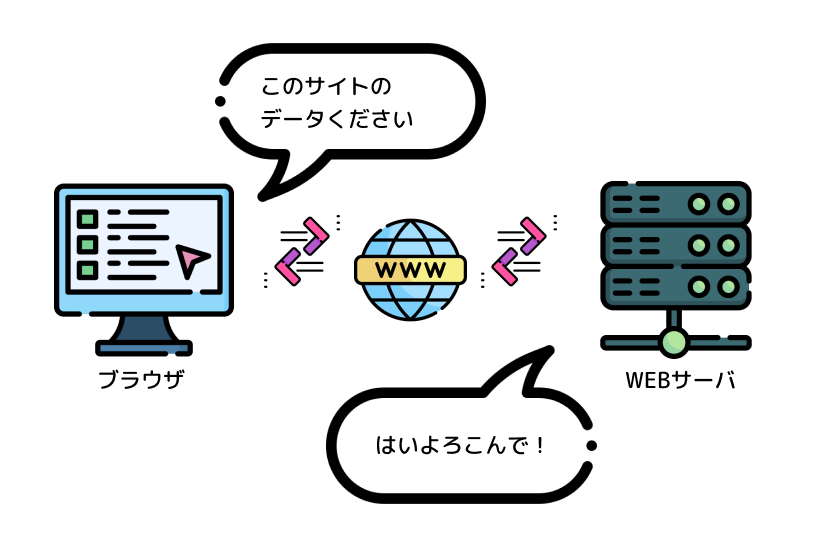
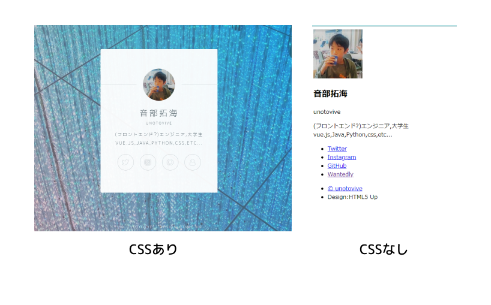
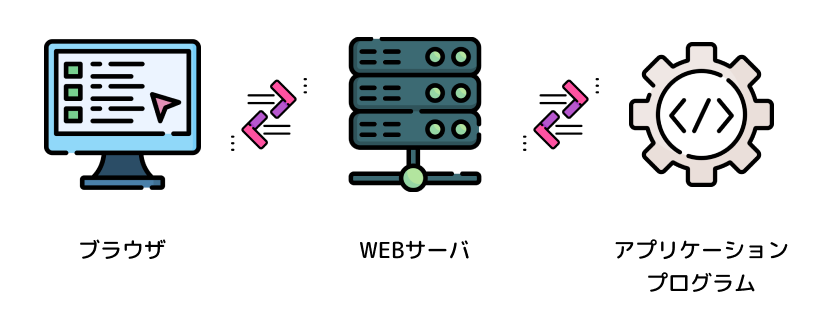
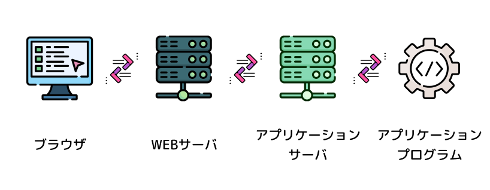
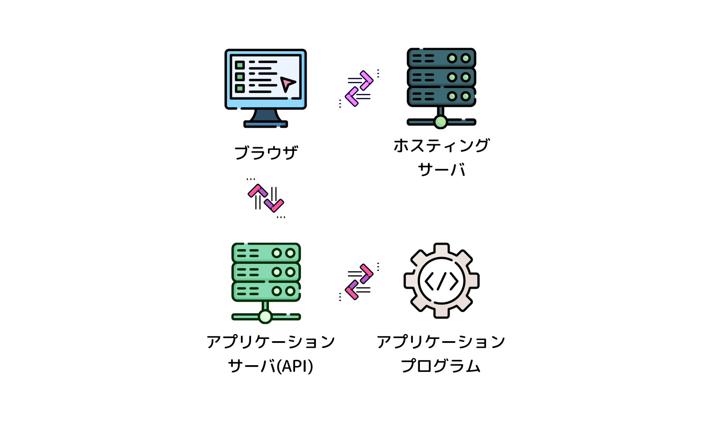
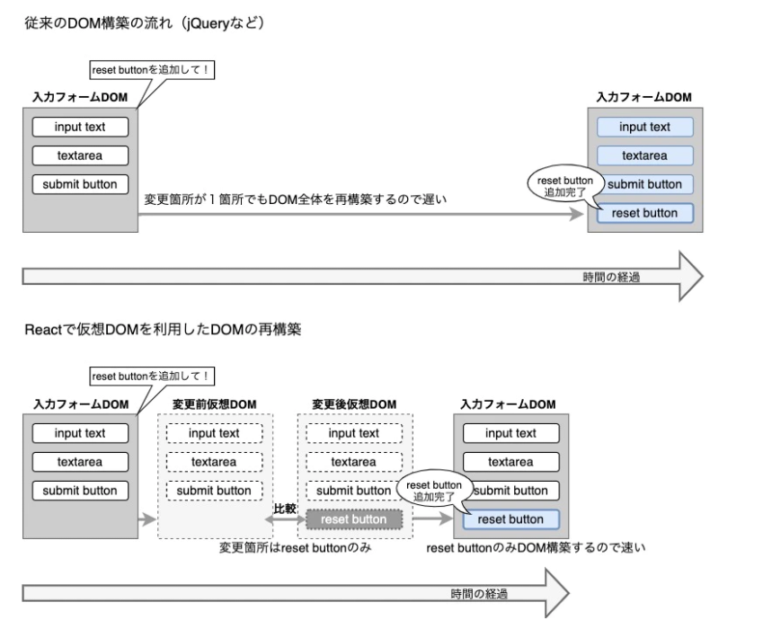

---
# try also 'default' to start simple
theme: penguin
# random image from a curated Unsplash collection by Anthony
# like them? see https://unsplash.com/collections/94734566/slidev
background: https://source.unsplash.com/collection/94734566/1920x1080
# apply any windi css classes to the current slide
class: 'text-center'
# show line numbers in code blocks
lineNumbers: true
# some information about the slides, markdown enabled
info: |
  ## Javascript中級講義資料#1
  VANTAN Techgord Academy
  Created by [@unotovive](https://twitter.com/unotovive)
fonts:
  sans: 'Noto Sans JP'
  # use with `font-serif` css class from windicss
  serif: 'Noto Sans JP'
  # for code blocks, inline code, etc.
  mono: 'Fira Code'
# persist drawings in exports and build
drawings:
  persist: false
layout: intro
---

# Javascript中級

VANTAN Techford Academy

### #1 概論と環境構築 / Webアプリケーション基礎
<div class="pt-12">
  <span @click="$slidev.nav.next" class="px-2 py-1 rounded cursor-pointer" hover="bg-white bg-opacity-10">
    Press Space for next page <carbon:arrow-right class="inline"/>
  </span>
</div>

---
layout: new-section
---

# 出席確認🖐

<!--
7分ぐらい
-->

---
layout: new-section
---

# ご挨拶🖐

<!--
5分ぐらい
-->

---
layout: presenter
presenterImage: ./assets/1/me.jpg
---

# Takumi Otobe

主にJavascript中級クラスを担当します。
<br>
半年ほどですがよろしくお願いします!

- 📝 **職業** - UX engineer / Designer at YUMEMI
- 🎨 **経歴** - あとで
- 🧑‍💻 **得意な技術** - Vue, React, Typescript, AWS
- 🤹 **趣味** - スノボとボルダリング

<br>
<br>

Twitterアカウント [@unotovive](https://twitter.com/unotovive)

---
layout: new-section
---

# 授業の概要

<!--
3分
-->

---

# 授業の概要

### フロントエンドの授業です
Javascriptという講義名ですが、Javascriptを利用したブラウザ上で動作するWebアプリケーションについて学び、簡単なアプリのフロントエンドを作成できるようになることが目的です。

<br>

### そもそもフロントエンドって？
本日の次のコマで詳しく解説します。主にブラウザで動くアプリケーションの僕たちが実際に触る部分です。

<!--
フロントエンドって何ぞやって話は今日の2コマ目でするよ！
-->

---

# 最終目標について

この講義の最終目標は、フロントエンドフレームワーク「Vue.js」を利用し、簡単なSPAを1から作れる実力をつけることです。
<br>
<br>
この最終目標を達成するために、Javascriptという言語の基本的な理解から、Vue.jsの基礎、Vue.jsを実際に使ってアプリを作る流れまでを学びます。


---
layout: new-section
---

# シラバスの確認

<!-- 
  10分ぐらい
 -->

---

# シラバスの確認

<br>

| 日程 | 1コマ目 | 2コマ目 |
| --- | --- | --- |
| <kbd>1</kbd> | 概論と環境構築 | Webアプリケーション基礎 |
| <kbd>2</kbd> | Javascript基礎① | Javascript基礎② |
| <kbd>3</kbd> | Javascript基礎③ |Javascript基礎④ |
| <kbd>4</kbd> | Javascript基礎⑤ | Javascript基礎⑥ |
| <kbd>5</kbd> | Vue.jsとは？ | Vue.jsの基礎① |
| <kbd>6</kbd> | Vue.jsの基礎② | Vue.jsの基礎③ |
| <kbd>7</kbd> | Vue.jsの基礎④ | Vue.jsの基礎⑤ |

---

# シラバスの確認

<br>

| 日程 | 1コマ目 | 2コマ目 |
| --- | --- | --- |
| <kbd>8</kbd> | TODOアプリハンズオン① | TODOアプリハンズオン② |
| <kbd>9</kbd> | TODOアプリハンズオン③ | TODOアプリハンズオン④ |
| <kbd>10</kbd> | TODOアプリハンズオン⑤ | TODOアプリハンズオン⑥ |
| <kbd>11</kbd> | Vue.js応用編① | Vue.js応用編② |

---

# シラバスの確認

<br>

| 日程 | 1コマ目 | 2コマ目 |
| --- | --- | --- |
| <kbd>12</kbd> | チーム開発について | Gitとバージョン管理 |
| <kbd>13</kbd> | 最終課題について | 最終課題 (テーマ発表会) |
| <kbd>14</kbd> | 実務Tips① | 最終課題検討① |
| <kbd>15</kbd> | 実務Tips② | 最終課題検討② |
| <kbd>16</kbd> | 最終発表会とフィードバック① | 最終発表会とフィードバック② |

---
layout: new-section
---

# 授業の進め方について

---

## こういう形式での講義が初めてです...!

（進め方、ペース配分等）なにかあったら気軽に言ってください！

※質問等は随時コメントで投稿してください！（挙手でも大丈夫）

---

## 講義資料は公開します！

<div class="flex flex-grow  pt-8">
<div>

講義資料は [htttps://kougisiryounourl.com/#1](htttps://kougisiryounourl.com/#1) で公開します。<br>

Password :  <code style="color: #fff;">vantan.js</code>

コード等もここに写すので適宜自分でみながら進めてください。
<br>
<br>

##### ※コピペはほどほどに

</div>
<div  class="h-xs flex-grow-0 pl-12">


</div>
</div>

<!--
コピペをするときは内容をよく読んで自分で理解したコードだけコピペしよう
-->

---
layout: new-section
---

# 環境構築

---

# 今回必要な環境

- **Node.js** : v14.18.0
- **n** : 最新版
- **VSCode** : 最新版
- **Google Chrome** : 最新版

---
layout: image-right
image: ./assets/1/node.png
---

# Node.js

以下の公式サイトから推奨版(14.18.0)を
<br>ダウンロードしてインストール

<div>
  <a href="https://nodejs.org/ja/" target="_blank" class="px-2 py-1 rounded cursor-pointer ring-inset bg-green-200">
    公式サイト <carbon:arrow-right class="inline"/>
  </a>
</div>

```bash
$ node -v
> v14.18.0

$ npm -v
> 6.14.13
```

---

### Node.jsとは?

v8 javascriptエンジンで動くJSの実行環境。<br>
ECMA Scriptの仕様にサーバーサイドで必要な機能を盛り込んだもの。
<br>
<br>

### ECMA Scriptとは...?

Javascriptの言語仕様のコア部分。<br>
毎年アップデートされて新機能が追加されたりしている(ES2020とか)

<!--
ESいくつの機能か確認しないと実行する環境によっては動かなかったり...
-->

---

# nの導入

「n」とは、nodeのバージョン管理ツールの一つ。
同じPC内で様々なバージョンのNodeを使い分けられます。

```bash
$ sudo npm install -g n
$ n --version
> v7.5.0
```

---

未インストールの場合、それぞれ最新版をインストールしましょう。

## VSCodeの導入

<div class="py-8">
  <a href="https://azure.microsoft.com/ja-jp/products/visual-studio-code/" target="_blank" class="px-2 py-1 rounded cursor-pointer ring-inset bg-green-200">
    公式サイト <carbon:arrow-right class="inline"/>
  </a>
</div>

## Google Chromeの導入

<div class="py-8">
  <a href="https://www.google.com/intl/ja_jp/chrome/" target="_blank" class="px-2 py-1 rounded cursor-pointer ring-inset bg-green-200">
    公式サイト <carbon:arrow-right class="inline"/>
  </a>
</div>

---

# VSCodeの設定

- formatOnSave: true
- Japanese Language Pack for Visual Studio Code
- prettierの導入
- Veturの導入
- CodeSpellCheckerの導入
- Material Icon Themeの導入
- (オススメ) Atom One Dark Theme

<!--
実際に導入しながら説明
-->

---
layout: new-section
---

# 1-2. Webアプリケーション基礎

---
layout: new-section
---

# Webアプリケーションとはなにか

---

# そもそもWebとは？

<br>

### Webの本来の意味: “クモの巣状のもの”

---

# Webとは

Webとは、インターネット上で標準的に用いられている文書の公開・閲覧システム。文字や図表、画像、動画などを組み合わせた文書を配布することができる。文書内の要素に別の文書を指し示す参照情報（ハイパーリンク）を埋め込むことができる「ハイパーテキスト」（hypertext）と呼ばれるシステムの一種である。
<br>
（[IT用語辞典 e-words](https://e-words.jp/w/Web.html)）

---

# Webの歴史

ティム・バーナーズ＝リーによって1991年8月6日に発表された技術

### Webの始まり
研究機関に在籍していたティムは、研究の文献やデータを1つのコンピュータに集め、そしてさらにその文書同士を「リンク」させる仕組みを計画し、それを実現した。
<br>
<br>
世界中に広がる情報網が「クモの巣」のように見えるという理由で、<br>
「世界中に広がるクモの巣」＝「World Wide Web(WWW)」と名付けた

<!-- 
ティムは、このシステムを発表する時にどんな名前にするかとても悩んでいたようです。たとえば「The Information Mine」という、「情報鉱山」という候補があったようです。これは頭文字を取ると「TIM(ティム)」になりますね。さすがにそれは自分本位すぎる！と思って止めたんだ、と後に本人のWebサイトで語られています。
 -->

---

### つまりWebとは

<br>

## 「世界中どこにいても、コンピューターなどによって情報を得られるシステム」

---

## アプリケーションとは?

---

## Webアプリケーションとは？
<br>

#### 本名、アプリケーションプログラム
<br>
何か特定の目的のために開発、使用されるソフトウェアの事。
<br>
<br>
ex: スマホのアプリ、Webアプリ、パソコンのソフト

---
layout: new-section
---

# Webページの仕組み

---

## 大まかな流れ



---

## Webサーバーとは？

<br>

### クライアント（ブラウザ）からリクエストを受けて、所定のデータを返却する
<br>
Webサーバーが返却するのはhtml,css,jsなどのブラウザが解釈できるファイル
<br>
<br>
あるファイルをそのまま返すこともあれば、リクエストのデータに基づいて何かを生成して返すこともある

###### Apache Nginxなどが有名

---
layout: new-section
---

# ブラウザの仕組み

---

# HTMLの表示をする

## HTMLとは
Hyper Text Markup Language。コンピューターが理解できる形式の文書構成ファイル
<br>
<br>
タイトル、本文、リンク、画像、表、リストなどを表現できる
<br>
<br>
※ 現状はhtml5が一般的に普及しているバージョン

---

# CSSで装飾する

## CSSとは
Cascading Style Sheets。HTMLの体裁や見た目を表現するための言語、W3C標準仕様で標準化されている。
###### カスケードとは、何段も連なった小さな滝のこと。転じて、同じものがいくつも数珠つなぎに連結された構造や、連鎖的あるいは段階的に物事が生じる様子を表す。
※現状はCSS3が一般的に普及しているバーション

---

# CSSで装飾する



---

# javascriptで「動作」を作る

## javascriptとは
ブラウザで動作する唯一のスクリプト言語で、Webページ上で複雑な機能や動きを実現する。
<br>
<br>
動くWebページ、モーダル、3Dアニメーション、トラッキングや計量化対策など、Webでのあらゆる動作を行う。

※詳しくは次週、javascript基礎でやります！

---
layout: new-section
---

# 動的なWebページの歴史

---

### Webサーバー + CGI
Webサーバーがリクエストを受け取るたびにアプリケーションプログラムを起動して処理を行い、その結果を標準出力で受け取る


<!-- だいぶ昔の話で、今はほとんど使われていない、Pythonの標準入出力をイメージしてもらうと分かりやすいかもしれない -->

---

### Webアプリケーションサーバー
Webアプリケーションを実行するサーバー。CGIとは違い常時起動している。
<br>
アプリケーションサーバーとプログラムの間ではメソッドなどでやり取りがされている。


<!-- 昨今の一般的なWebアプリケーションの一つ -->

---
layout: new-section
---

# モダンフロントエンド時代

---

# v8 Javascriptエンジンの登場
Google製OSSのJavascriptエンジン。2008年ぐらいに公開され、Google ChromeやNode.js等様々な所で使われている

作者はラース・バクさん。スクリプト言語なのにめっちゃ早い。<a href="https://blog.kkty.jp/entry/2019/01/10/204947" target="_blank">高速化について</a>

###### ちなみにC++で書かれている

<!-- この人はJAVA仮想環境の高速化システムとかも作ってる高速オタク -->

---

# SPA + APIモデルの登場

高速なv8 javascriptエンジンの登場に伴い、javascript(frontend)周りの技術進化が一気に起こった。
<br>
仮想DOMやコンポーネント思考、などの新しい概念がたくさん生まれ、それらの技術を駆使したSPA + APIモデルなアプリケーションが登場した。

---

# APIとは
Application Programing Interface。アプリケーションと他の何かをつなぐためのインターフェース。
<br>
<br>
今回で言うAPIは中でもWebAPIといわれるもので、HTTP(s)通信を利用し、アプリケーションに対してリクエストを送ったり、
<br>
アプリケーションの情報を出力してもらうための物。HTMLやCSSではなく、jsonなどでデータのみをやり取りする。

###### Web以外にもアプリなどからも共通で利用できるというのもAPIの良いところ
<br>　

# SPAとは
Single Page Application。単一ページで動作するアプリケーションのこと。
一つのhtml上で、アプリケーションのUIを構築し、画面遷移などはjavascriptによって見せているページを切り替えて行う。
<br>
データの取得はAPIからjsonなどでデータのみを取得する。（HTML等はイチイチ取得しない）
<br>
※初回アクセス時に前ページのUIを取得するので、少し重い（逆にページ遷移はとてもスムーズ）
<!-- それじゃさっきのWebアプリケーションと何が違うの？をちゃんと説明 -->

---

## SPA + APIモデル



---
layout: new-section
---

# 難しいの概念なので実物を見てみよう

<!-- SPAを表示してNetworkタブで説明を行うとよさそう -->

---

## フロントエンドフレームワークの登場

<br>

### フレームワークとは？
開発におけるアプリケーションの枠組み、土台部分を意味します。英語のFrameworkという言葉は、「枠組み」という意味で、開発における「フレームワーク」は、システムの骨組みと表現されることがあります。


SPAなどの複雑化したフロントエンドを構築するために、仮想DOMやコンポーネント思考などの概念を持ったフロントエンドフレームワークが登場した。（Vue, React, Angular）<br>
VanillaJSで書くと死ぬほど大変なコードを簡潔に書けるようにしてくれる。

<!-- Reactは一応ライブラリだよ -->

---
layout: new-section
---

# モダンフロントエンドの技術

---

## コンポーネント指向
UIをパーツごとに切り出し、構造・見た目・振る舞いをセットにして1コンポーネントとして定義する。これにより同じような部品を再利用することでコード量を削減し、可読性を向上させられる。

## 仮想DOM
DOMとは「Document Object Model」で、木構造のデータ。<br>
ブラウザにページを表示するためのデータで、Javascriptなどで操作可能。厳密には違うけども基本的にHTMLと同じようなイメージで大丈夫
###### 開発者ツールのElementsタブで見えるのがDOM
<br>

### 仮想DOMとは
インメモリに保持された想像上のまたは「仮想の」（仮の）UI 表現が、ライブラリによって「実際の」DOM と同期されるというプログラミング上の概念。
同期プロセスは差分検出処理 (reconciliation)と呼ばれる。

---

### 仮想DOMとは



---

## SSRとJamstack

SPAは単一のアプリケーションであるが故に、SEO対策やパフォーマンスなどで問題を抱えており、それを解決するために近年よく出てくるのが、SSR (Server Side Rendering) と Jamstack (Static Site Generation)です。
<br><br>

<a class="mb-4" href="https://medium.com/@sundaycrafts/%E3%83%A6%E3%83%BC%E3%82%B6%E3%83%BC%E4%BD%93%E9%A8%93%E3%82%92%E5%90%91%E4%B8%8A%E3%81%95%E3%81%9B%E3%82%8B%E3%82%B5%E3%83%BC%E3%83%90%E3%83%BC%E3%82%B5%E3%82%A4%E3%83%89%E3%83%AC%E3%83%B3%E3%83%80%E3%83%AA%E3%83%B3%E3%82%B0javascript-%E6%AD%B4%E5%8F%B2%E3%81%A8%E5%88%A9%E7%82%B9-df68cd7cd991" target="_blank">SSRについて</a>

<br>
<br>

<a href="https://blog.microcms.io/what-is-jamstack/" target="_blank">Jamstackについて</a>

###### 今回の授業では詳しく取り扱いませんが、気になる人は聞いてください！

---

## Webの技術でできること
<br>
<br>

- CLIツールやサーバー（Node.js）
- モバイルアプリ（ReactNative / Ionic）
- デスクトップアプリ（Electron）
- ホーム画面にインストール、オフラインで動かす（PWA）
- IoT (Node.js)
- 機械学習（TensorFlow.js）
- C/C++で書かれたようなコードを動かす（WebAssembly）
- 音楽、動画、高度な3Dゲームその他（AudioAPI / Three.jsなど）

---
layout: new-section
---

# フロントエンドの技術が出来れば
# 割と何でもできる！！！

---

## 今回のJavascript中級
フロントエンドフレームワークのVueを学びます。
フロントエンドフレームワークは全体的に思想が似ている部分もあり、一つを学ぶことで他のフレームワークへの学習アプローチがしやすくなることもあります。

## 来週
Javascriptの概念や仕様から、基本的な文法を学びます！