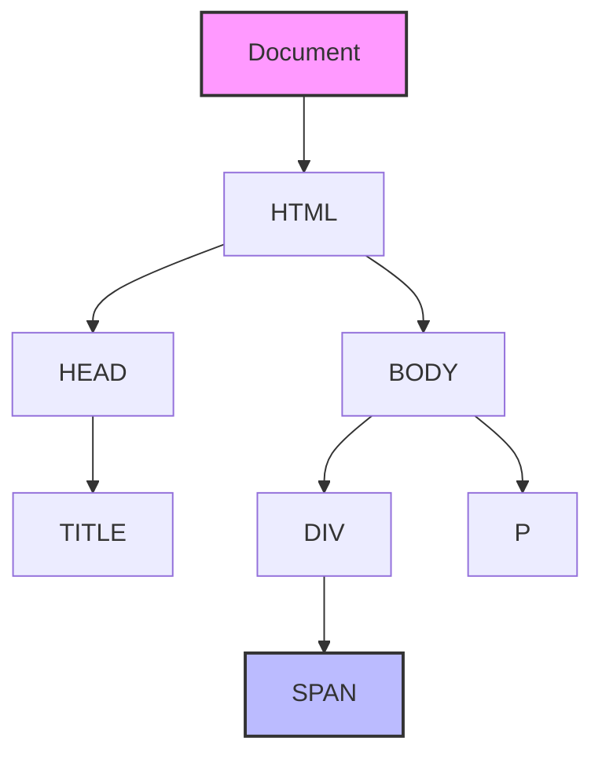
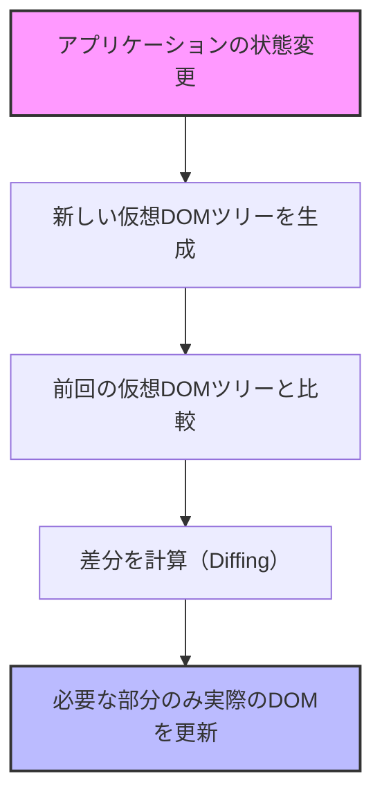
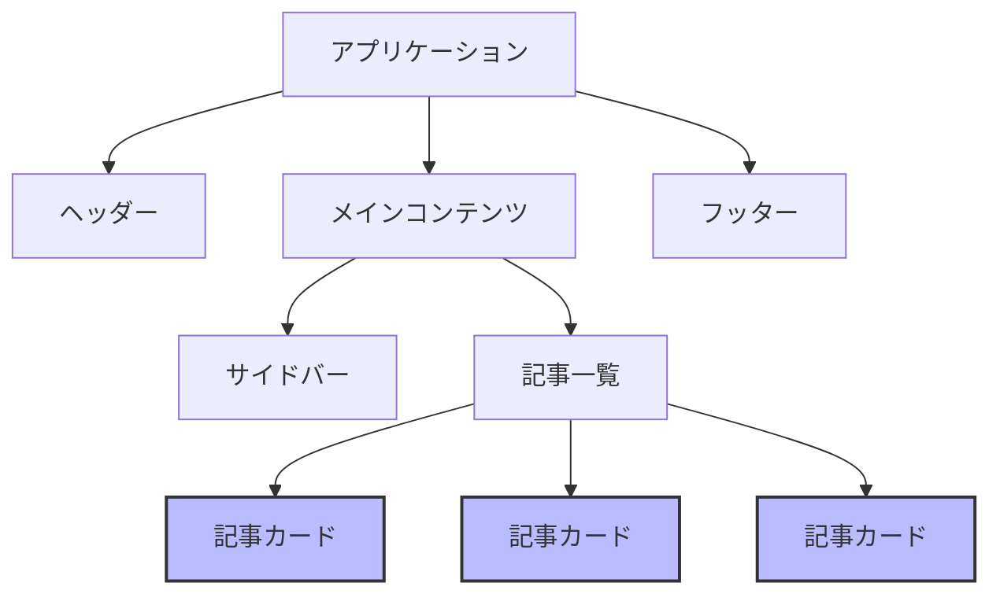

# TypeScript + React<br>ハンズオン講座

## 第4回：React でポケモン検索アプリ開発

<div class="pt-12">
  <span @click="$slidev.nav.next" class="px-2 py-1 rounded cursor-pointer" hover="bg-white bg-opacity-10">
    Press Space for next page <carbon:arrow-right class="inline"/>
  </span>
</div>

<div class="abs-br m-6 flex gap-2">
  <button @click="$slidev.nav.openInEditor()" title="Open in Editor" class="text-xl slidev-icon-btn opacity-50 !border-none !hover:text-white">
    <carbon:edit />
  </button>
</div>

<style>
h1 {
  background-color: #fff;
  background-image: none;
}
</style>

---
layout: default
---

# 本日の内容

<Toc minDepth="2" maxDepth="2" />

<style>
h2 {
  margin: 1rem 0;
}
</style>

## 👉️ React の基本概念とJSX
## 👉️ React コンポーネントと型定義
## 👉️ ポケモン検索アプリ「Poke Search」のハンズオン

---
layout: section
---

# Reactの基本概念とJSX

---
layout: default
---

# Reactとは？

<div grid="~ cols-2 gap-4">
<v-clicks>
<div>

## Reactの概要

- Facebookが開発したJavaScriptライブラリ
- ユーザーインターフェイスを構築するための宣言的なアプローチ
- **コンポーネントベース**の設計思想
- データの変更に応じて効率的に再レンダリング
- 幅広いエコシステムと活発なコミュニティ
- モバイル（React Native）やデスクトップにも展開

</div>
<div>

## Reactの特徴

- **宣言的UI**：「どのように」ではなく「何を」表示するかに集中
- **コンポーネント志向**：再利用可能なUI部品
- **Learn Once, Write Anywhere**：多様なプラットフォームで活用可能
- **単方向データフロー**：予測可能な動作
- **JSX**：JavaScriptの中にHTMLライクな構文
- **仮想DOM**：効率的な更新メカニズム

</div>
</v-clicks>
</div>

---
layout: default
---

# DOM（Document Object Model）

<div grid="~ cols-2 gap-4">
<v-clicks>
<div>

## DOMとは

- HTMLドキュメントをツリー構造で表現したもの
- ブラウザがHTMLを解析して作成する
- 各要素（ノード）が親子関係で結ばれる
- JavaScriptから操作可能なAPIを提供
- 動的なWebアプリケーションの基盤


</div>
<div>

## DOMの特徴

- **ツリー構造**: 要素が階層的に配置される
- **動的更新**: JavaScriptで要素の追加・削除・変更が可能
- **イベント処理**: ユーザー操作に応答する仕組み
- **スタイル操作**: CSSの動的な変更が可能
- **クロスブラウザ**: 標準化されたAPIを提供

</div>
</v-clicks>
</div>

---
layout: default
---

# DOMの構造と操作

<div grid="~ cols-2 gap-4">

<div class="flex justify-center max-w-lg">

<v-clicks>



</v-clicks>

</div>

<v-clicks>

<div>

## DOMの基本操作

<br />

1. **要素の取得**: `getElementById`, `querySelector`など
2. **要素の作成**: `createElement`, `createTextNode`
3. **要素の追加**: `appendChild`, `insertBefore`
4. **要素の削除**: `removeChild`, `remove`
5. **属性の操作**: `setAttribute`, `getAttribute`

```javascript
// DOM操作の例
const div = document.createElement('div');
div.textContent = 'Hello, DOM!';
document.body.appendChild(div);
```

</div>
</v-clicks>
</div>

---
layout: default
---

# DOMのパフォーマンス課題

<div grid="~ cols-2 gap-4">
<v-clicks>
<div>

## DOM操作のコスト

<br />

- 要素の追加・削除は高コスト
- レイアウトの再計算が必要
- レンダリングの再実行が発生
- 頻繁な更新でパフォーマンス低下
- 複雑なUIでは特に影響大


</div>
<div>

## 一般的な解決策

<br />


- **バッチ処理**: 複数の更新をまとめる
- **最小限の更新**: 必要な部分のみ変更
- **DocumentFragment**: 仮想的な更新
- **requestAnimationFrame**: 最適なタイミングで更新
- **メモ化**: 不要な再計算を防ぐ

</div>
</v-clicks>
</div>

---
layout: default
---

# 仮想DOM（Virtual DOM）

<div grid="~ cols-2 gap-4">
<v-clicks>
<div>

## 仮想DOMとは


- 実際のDOMの軽量なコピー（JavaScriptオブジェクト）
- メモリ上に存在する仮想的な表現
- 実際のDOMとの変更を効率的に比較
- 必要な部分だけを更新（差分更新）


</div>
<div>

## 仮想DOMの利点


- **パフォーマンスの向上**：必要な箇所のみ更新
- **バッチ処理**：複数の変更をまとめて処理
- **クロスプラットフォーム**：DOM依存からの解放
- **宣言的コード**：命令的なDOM操作が不要
- **開発者体験の向上**：コンポーネントの状態に集中


</div>
</v-clicks>
</div>

---
layout: default
---

# 仮想DOMの仕組み

<div grid="~ cols-2 gap-4">

<div class="flex justify-center max-w-lg">

<v-clicks>



</v-clicks>

</div>

<v-clicks>

<div>

## 仮想DOMの処理フロー

<br />

1. **状態変更**: コンポーネントの状態（state/props）が変更される
2. **仮想DOM生成**: 新しい状態に基づいた仮想DOMツリーを生成
3. **差分検出（Reconciliation）**: 前回の仮想DOMツリーと比較
4. **最小限の更新計画**: 変更が必要な最小限の操作を特定
5. **実際のDOM更新**: 計画に基づいて実際のDOMを効率的に更新

</div>
</v-clicks>
</div>

---
layout: two-cols
---

# React での実装


<v-clicks>

<div>

## コード

```jsx
// ユーザーリストを表示するコンポーネント
const UserList = () => {
  const [users, setUsers] = React.useState([
    'Alice', 'Bob', 'Charlie'
  ]);

  const addUser = (name) => {
    setUsers([...users, name]);
  }

  return (
    <div>
      <ul>
        {users.map(user => (<li key={user}>{user}</li>))}
      </ul>
      <button onClick={() => addUser('Dave')}>
        Add User
      </button>
    </div>
  );
}
```

</div>
</v-clicks>

::right::

<v-clicks>

<div class="pl-8 mt-18">

## 特徴

- 宣言的 UI
- データとUIの自動同期
- コンポーネントとして再利用可能

</div>
</v-clicks>

---
layout: default
---

# コンポーネント指向の考え方

<div grid="~ cols-2 gap-4">
<div class="flex justify-center　max-w-lg">

<v-clicks>



</v-clicks>

</div>


<v-clicks>
<div>

## コンポーネント設計の利点

<br />

- **再利用性**: 同じコンポーネントを複数の場所で使用
- **保守性**: 特定の機能を担当するコードが集約される
- **テスト容易性**: コンポーネント単位でテスト可能
- **関心の分離**: 各コンポーネントが特定の役割に集中
- **並行開発**: チームで分担して開発可能
- **段階的UI構築**: 小さなコンポーネントから大きなシステムを構築

</div>
</v-clicks>
</div>

---
layout: section
---

# React の開発環境

---
layout: default
---

# Vite での React + TypeScriptプロジェクト構成

<div>

## プロジェクト作成方法


```bash
# プロジェクト作成
npm create vite@latest my-react-app -- --template react-ts

# ディレクトリに移動
cd my-react-app

# 依存パッケージのインストール
npm install

# 開発サーバーの起動
npm run dev
```

</div>

---
layout: default
---

# メインエントリーポイントの解説

### main.tsx

```tsx {all|3-5|6-10}
import { StrictMode } from "react";
import { createRoot } from "react-dom/client";
import "./index.css";
import App from "./App.tsx";

createRoot(document.getElementById("root")!).render(
	<StrictMode>
		<App />
	</StrictMode>,
);

```

- `React`: Reactのコアライブラリ
- `ReactDOM`: ブラウザDOM操作用のライブラリ
- `createRoot`: React 18の新しいルートAPI
- `<React.StrictMode>`: 開発モードで追加チェックを有効化


---
layout: default
---

# ルートコンポーネントの解説

## App.tsx

```tsx {all|1-2|4-5,11,17|7-16}
import { useState } from "react";
import "./App.css";

function App() {
	const [count, setCount] = useState(0);

	return (
		<>
			<h1>Vite + React</h1>
			<div className="card">
				<button onClick={() => setCount((count) => count + 1)}>
					count is {count}
				</button>
			</div>
		</>
	);
}

export default App;
```

---
layout: default
---


# JSX の基本

<div grid="~ cols-2 gap-4">
<v-clicks>
<div>

## JSXとは

<br />

JSX（JavaScript XML）は、JavaScript の拡張構文で、React 要素を作成するための構文糖です。

```jsx
// JSXの例
const element = <h1>Hello, world!</h1>;

// 複数の要素
const content = (
  <div>
    <h1>タイトル</h1>
    <p>段落テキスト</p>
  </div>
);
```

</div>
<div>

## JSXの特徴

<br />

- HTMLライクな構文でUIを表現
- JavaScript式を `{}` で埋め込み可能
- 属性はキャメルケース（`className`, `onClick`など）
- 全ての要素は閉じる必要がある（``など）
- 複数要素は単一の親要素で囲む必要がある

</div>
</v-clicks>
</div>

---
layout: default
---

# JSX で式を使う

※以下，見やすさのために改行していますが，基本的には改行はしません．

<div grid="~ cols-2 gap-4">
<v-clicks>
<div>

## JSX に式を埋め込む

```jsx
const name = 'React';
const element = <h1>Hello, {name}!</h1>;

const user =
  { firstName: 'Harper', lastName: 'Perez' };
const greeting =
  <h1>Hello, {user.firstName} {user.lastName}!</h1>;

const getGreeting = (user) => {
  return user
    ? `Hello, ${user.name}!`
    : 'Hello, Stranger!';
};
const welcome = <h1>{getGreeting(user)}</h1>;
```

</div>
<div>

## 属性の設定

```jsx
// 文字列リテラル
const element = <div tabIndex="0"></div>;

// JavaScript式
const element = ;

// スタイルオブジェクト
const style = { color: 'red', fontSize: '16px' };
const element =
  <p style={style}>スタイル付きテキスト</p>;
```

</div>
</v-clicks>
</div>

---
layout: default
---

# TypeScript と JSXの連携

<div grid="~ cols-2 gap-4">
<v-clicks>
<div>

## TypeScript での JSX

```tsx
const name: string = 'React';
const element = <h1>Hello, {name}!</h1>;

interface User {
  firstName: string;
  lastName: string;
  age: number;
}

const user: User = {
  firstName: 'Harper',
  lastName: 'Perez',
  age: 25
};

const greeting = (
  <div>
    <h1>Hello, {user.firstName} {user.lastName}!</h1>
    <p>Age: {user.age}</p>
  </div>
);
```

</div>
<div>

## 型チェックの恩恵

- プロパティ名のタイプミスを検出
- 必要なプロパティの欠落を検出
- 誤った型の値の使用を防止

</div>
</v-clicks>
</div>

---
layout: default
---

# JSX の条件付きレンダリング

<div grid="~ cols-2 gap-4">
<v-clicks>
<div>

## 条件演算子（三項演算子）

```tsx
const isLoggedIn: boolean = true;

const greeting = (
  <div>
    {isLoggedIn
      ? <h1>Welcome back!</h1>
      : <h1>Please sign in.</h1>
    }
  </div>
);
```

</div>
<div>

## 論理演算子 `&&`

```tsx
const messages: string[] =
  ['React', 'TypeScript', 'Vite'];

const messageList = (
  <div>
    <h1>メッセージ一覧</h1>
    {messages.length > 0 && (
      <ul>
        {messages.map(message => (
          <li key={message}>{message}</li>
        ))}
      </ul>
    )}
  </div>
);
```

</div>
</v-clicks>
</div>

---
layout: default
---

# JSX でリストをレンダリングする

<div grid="~ cols-2 gap-4">
<v-clicks>
<div>

### `map` を使ったリストレンダリング

```tsx
interface Item {
  id: number;
  name: string;
}

const items: Item[] = [
  { id: 1, name: 'React' },
  { id: 2, name: 'TypeScript' },
  { id: 3, name: 'Vite' }
];

const itemList = (
  <ul>
    {items.map(item => (
      <li key={item.id}>{item.name}</li>
    ))}
  </ul>
);
```

</div>
<div>

### `key` の重要性

- 各リスト項目に一意の `key` プロパティが必要
- Reactが効率的にDOMを更新するために使用
- 通常は、データのIDを使用（インデックスは最後の手段）
- キーがないと警告が表示され、パフォーマンスに影響

</div>
</v-clicks>
</div>

---
layout: section
---

# Reactコンポーネントと型定義

---
layout: default
---

# 関数コンポーネントの基本

## 関数コンポーネントとは

関数コンポーネントは、PropsをインプットとしてJSX要素を返す純粋なJavaScript関数です💁

```tsx
function Welcome() {
  return <h1>Hello, World!</h1>;
}

// アロー関数での定義も可能
const Welcome = () => {
  return <h1>Hello, World!</h1>;
};

// 省略記法（暗黙のreturn）
const Welcome = () => <h1>Hello, World!</h1>;

// コンポーネントの使用
const App = () => (
  <div>
    <Welcome />
  </div>
);
```

---
layout: default
---

# Propsを受け取る関数コンポーネント

<div grid="~ cols-2 gap-4">
<v-clicks>
<div>

## Propsの基本

```tsx
// JavaScriptでのProps
function Welcome(props) {
  return <h1>Hello, {props.name}</h1>;
}

// 使用方法
<Welcome name="Alice" />
```

</div>
<div>

## TypeScript での Props

```tsx
// インライン型定義
function Welcome(props: { name: string }) {
  return <h1>Hello, {props.name}</h1>;
}

// インターフェイスを使用
interface WelcomeProps {
  name: string;
}

function Welcome(props: WelcomeProps) {
  return <h1>Hello, {props.name}</h1>;
}

// 使用方法
<Welcome name="Alice" />
```

</div>
</v-clicks>
</div>

---
layout: default
---

# 分割代入を使用したProps

<div grid="~ cols-2 gap-4">
<v-clicks>
<div>

## 分割代入の活用

```tsx
interface WelcomeProps {
  name: string;
  age?: number;  // オプショナルプロパティ
}

function Welcome({ name, age }: WelcomeProps) {
  return (
    <div>
      <h1>Hello, {name}!</h1>
      {age !== undefined && <p>Age: {age}</p>}
    </div>
  );
}

const App = () => (
  <div>
    <Welcome name="Alice" age={25} />
    <Welcome name="Bob" />
  </div>
);
```

</div>
<div>

## 分割代入の利点

- コード量の削減（`props.` の繰り返しを避ける）
- 使用するプロパティを明示的に示す
- デフォルト値の設定が容易

</div>
</v-clicks>
</div>

---
layout: default
---

# デフォルト値を持つProps

<div grid="~ cols-2 gap-4">
<div>

## デフォルト値の設定方法

```tsx
interface GreetingProps {
  name: string;
  greeting?: string;  // オプショナル
  showAge?: boolean;  // オプショナル
  age?: number;       // オプショナル
}

function Greeting({
  name,
  greeting = 'Hello',
  showAge = false,
  age = 30
}: GreetingProps) {
  return (
    <div>
      <h1>{greeting}, {name}!</h1>
      {showAge && <p>Age: {age}</p>}
    </div>
  );
}
```

</div>

<div class="mt-9">

```tsx
// （続き）
const App = () => (
  <div>
    <Greeting name="Alice" greeting="Welcome" showAge age={25} />
    <Greeting name="Bob" showAge />
    <Greeting name="Charlie" />
  </div>
);
```

</div>
</div>

---
layout: default
---

# 子要素を受け取るコンポーネント

<div grid="~ cols-2 gap-4">
<div>

## childrenプロパティ

```tsx
interface CardProps {
  title: string;
  children: React.ReactNode;  // 子要素の型
}

const Card = ({ title, children }: CardProps) => (
  <div className="card">
    <div className="card-header">
      <h2>{title}</h2>
    </div>
    <div className="card-body">
      {children}
    </div>
  </div>
);
```

</div>

<div class="mt-9">

```tsx
const App = () => (
  <div>
    <Card title="Welcome">
      <p>This is a card component.</p>
      <button>Click me</button>
    </Card>

    <Card title="Features">
      <ul>
        <li>TypeScript Support</li>
        <li>React Components</li>
        <li>Vite for development</li>
      </ul>
    </Card>
  </div>
);
```

</div>
</div>

---
layout: default
---

# イベントハンドリングとTypeScript

<div grid="~ cols-2 gap-4">
<v-clicks>
<div>

### イベント型の活用

```tsx
interface ButtonProps {
  label: string;
  onClick: (event: React.MouseEvent<HTMLButtonElement>) => void;
}

const Button = ({ label, onClick }: ButtonProps) => (
  <button onClick={onClick}>{label}</button>
);

const App = () => {
  const handleClick = (event: React.MouseEvent<HTMLButtonElement>) => {
    console.log('Button clicked!', event.currentTarget.innerText);
  };

  return (
    <div>
      <Button label="Click me" onClick={handleClick} />
    </div>
  );
};
```

</div>
<div>

### 主なイベント型

- `React.MouseEvent<HTMLElement>`
  - マウスイベント
- `React.ChangeEvent<HTMLInputElement>`
  - 入力変更イベント
- `React.FormEvent<HTMLFormElement>`
  - フォームイベント
- `React.KeyboardEvent<HTMLElement>`
  - キーボードイベント

</div>
</v-clicks>
</div>

---
layout: default
---

# フォーム要素とイベント処理

<div grid="~ cols-2 gap-4">
<div>

```tsx
import { useState, ChangeEvent, FormEvent } from 'react';

interface FormData {
  username: string;
  email: string;
}

const ContactForm = () => {
  // フォームデータの状態
  const [formData, setFormData] = useState<FormData>({
    username: '',
    email: ''
  });

  // 入力変更ハンドラー
  const handleChange = (e: ChangeEvent<HTMLInputElement>) => {
    const { name, value } = e.target;
    setFormData(prev => ({
      ...prev,
      [name]: value
    }));
  };
```

</div>

<div>

```tsx
  const handleSubmit = (e: FormEvent<HTMLFormElement>) => {
    e.preventDefault();  // デフォルトの送信動作を防止
    // ここでAPIリクエストなどの処理を行う
  };
  return (
    <form onSubmit={handleSubmit}>
      <div>
        <label htmlFor="username">Username:</label>
        <input
          value={formData.username}
          onChange={handleChange}
        />
      </div>
      <div>
        <label htmlFor="email">Email:</label>
        <input
          type="email"
          value={formData.email}
          onChange={handleChange}
        />
      </div>
      <button type="submit">Submit</button>
    </form>
  );
};
```

</div>
</div>

<style>
h1 {
  font-size: 1.2rem;
  margin-bottom: 0 !important;
}
</style>

---
layout: default
---

# コンポーネント設計パターン

<div grid="~ cols-2 gap-4">
<v-clicks>
<div>

### コンポーネント分類の考え方

1. **表示コンポーネント**（Presentational Components）
   - UI表示に特化
   - データをPropsとして受け取る
   - 通常、状態を持たない（または UI 状態のみ）
   - 再利用性が高い

2. **コンテナコンポーネント**（Container Components）
   - データ取得やロジックに特化
   - 表示コンポーネントにデータを提供
   - アプリケーションの状態管理
   - 副作用の処理（API呼び出しなど）

</div>
</v-clicks>

<v-clicks>
<div class="mt-10">

3. **高階コンポーネント**（Higher-Order Components, HOC）
   - コンポーネントを受け取り、拡張したコンポーネントを返す関数
   - 横断的関心事の分離（認証、ログなど）

4. **カスタムフック**
   - ロジックを抽出して再利用
   - コンポーネントとして設計されない状態とロジック

</div>
</v-clicks>
</div>

<style>
p {
  margin-bottom: 0;
}
</style>

---
layout: default
---


# 型定義の共有とエクスポート

<div grid="~ cols-2 gap-4">
<v-clicks>
<div>

### 型定義ファイルの作成

```tsx
// src/types/index.ts
export interface User {
  id: number;
  name: string;
  email: string;
  role: 'admin' | 'user';
}

export interface Post {
  id: number;
  title: string;
  content: string;
  author: User;
  createdAt: string;
}

export interface Comment {
  id: number;
  postId: number;
  text: string;
  author: User;
  createdAt: string;
}
```

</div>
<div>

### 型定義のインポート

```tsx
// src/components/UserList.tsx
import { User } from '../types';

interface UserListProps {
  users: User[];
  onUserSelect: (user: User) => void;
}

const UserList = ({ users, onUserSelect }: UserListProps) => {
  // コンポーネントの実装
};
```

<br />

### 型定義の集中管理の利点

- コードの一貫性を確保
- 型定義の重複を防止
- 変更が必要な場合、一箇所で対応可能
- チーム間での型の共有が容易

</div>
</v-clicks>
</div>

<style>
h1 {
  margin-bottom: 0 !important;
}
</style>

---
layout: default
---

# プロジェクト構造とコンポーネント分割

<div grid="~ cols-2 gap-4">
<div>

### 機能/役割ベースの構造

```
src/
├── components/             # 共通コンポーネント
│   ├── Button/
│   │   ├── Button.tsx
│   │   └── index.ts
│   ├── Card/
│   │   ├── Card.tsx
│   │   └── index.ts
│   └── ...
├── features/              # 機能別モジュール
│   ├── auth/              # 認証機能
│   │   ├── components/    # 認証関連コンポーネント
│   │   ├── hooks/         # 認証関連カスタムフック
│   │   ├── types.ts       # 認証関連の型定義
│   │   └── index.ts       # エクスポート
│   ├── users/             # ユーザー管理機能
│   └── ...
├── hooks/                 # グローバルカスタムフック
├── types/                 # 共通型定義
├── utils/                 # ユーティリティ関数
└── App.tsx                # ルートコンポーネント
```

</div>

<div>

### バレルファイル（index.ts）の活用

```typescript
// src/components/Button/index.ts
export * from './Button';
export { default } from './Button';

// インポート側
import Button from '@/components/Button';
```

</div>
</div>

---
layout: default
---

# コンポーネント設計の実践例

```tsx
import { ButtonHTMLAttributes } from 'react';

interface ButtonProps extends ButtonHTMLAttributes<HTMLButtonElement> {
  variant?: 'primary' | 'secondary' | 'danger';
  size?: 'small' | 'medium' | 'large';
}

const Button = ({
  children,
  variant = 'primary',
  size = 'medium',
  className = '',
  ...rest
}: ButtonProps) => {
  const variantClass = `${baseClass}--${variant}`;
  const sizeClass = `${baseClass}--${size}`;

  return (
    <button className={`${variantClass} ${sizeClass} ${className}`} {...rest}>
      {children}
    </button>
  );
};
export default Button;
```

<style>
h1 {
  margin-bottom: 0 !important;
}
</style>

---
layout: default
---

# HTMLタグの属性を拡張する

<div grid="~ cols-2 gap-4">
<v-clicks>
<div>

```tsx
import { InputHTMLAttributes } from 'react';

interface TextInputProps extends InputHTMLAttributes<HTMLInputElement> {
  label: string;
  error?: string;
}

const TextInput = ({
  label,
  error,
  id,
  className = '',
  ...rest
}: TextInputProps) => {
  // ユニークなIDを生成（idが提供されていない場合）
  const inputId = id || `input-${label.toLowerCase().replace(/\s+/g, '-')}`;

  return (
    <div className="form-field">
      <label htmlFor={inputId}>{label}</label>
      <!-- 続く -->
```

</div>
<div>

```tsx
// 続き
      <input
        id={inputId}
        className={`form-input ${error ? 'form-input--error' : ''} ${className}`}
        {...rest}
      />
      {error && <div className="form-error">{error}</div>}
    </div>
  );
};

const Form = () => (
  <form>
    <TextInput
      label="Username"
      placeholder="Enter your username"
      required
      minLength={3}
      value={username}
      onChange={handleChange}
      error={errors.username}
    />
  </form>
);
```

</div>
</v-clicks>
</div>

---
layout: default
---

# 制約付きProps（ジェネリクスの活用）①

<div grid="~ cols-2 gap-4">
<v-clicks>
<div>

```tsx
interface SelectOption<T> {
  label: string;
  value: T;
}
interface SelectProps<T> {
  options: SelectOption<T>[];
  value: T;
  onChange: (value: T) => void;
  label?: string;
  disabled?: boolean;
}

function Select<T extends string | number>({
  options,
  value,
  onChange,
  label,
  disabled = false
}: SelectProps<T>) {
  const handleChange = (e: React.ChangeEvent<HTMLSelectElement>) => {
    // 値の型を適切に変換
    const newValue = e.target.value as unknown as T;
    onChange(newValue);
  };
```

</div>
<div>

```tsx
  return (
    <div className="select-container">
      {label && <label>{label}</label>}
      <select
        value={value as unknown as string}
        onChange={handleChange}
        disabled={disabled}
      >
        {options.map(option => (
          <option key={String(option.value)} value={String(option.value)}>
            {option.label}
          </option>
        ))}
      </select>
    </div>
  );
}
```

</div>
</v-clicks>
</div>

---

# 制約付きProps（ジェネリクスの活用）②

<div grid="~ cols-2 gap-4">
<v-clicks>
<div>

```tsx
// 使用例（文字列値）
const StringSelect = () => {
  const [selectedColor, setSelectedColor] = useState<string>('red');
  const colorOptions: SelectOption<string>[] = [
    { value: 'red', label: 'Red' },
    { value: 'green', label: 'Green' },
    { value: 'blue', label: 'Blue' }
  ];

  return (
    <Select<string>
      options={colorOptions}
      value={selectedColor}
      onChange={setSelectedColor}
      label="Select Color"
    />
  );
};
```

</div>
<div>

```tsx
// 使用例（数値値）
const NumberSelect = () => {
  const [selectedId, setSelectedId] = useState<number>(1);
  const userOptions: SelectOption<number>[] = [
    { value: 1, label: 'User 1' },
    { value: 2, label: 'User 2' },
    { value: 3, label: 'User 3' }
  ];

  return (
    <Select<number>
      options={userOptions}
      value={selectedId}
      onChange={setSelectedId}
      label="Select User"
    />
  );
};
```

</div>
</v-clicks>
</div>

---
layout: default
---

# カスタムフックで再利用可能なロジック

<div grid="~ cols-2 gap-4">
<v-clicks>
<div>

```tsx
import { useState, useEffect } from 'react';

// ウィンドウサイズを監視するカスタムフック
function useWindowSize() {
  const [size, setSize] = useState({
    width: window.innerWidth,
    height: window.innerHeight
  });

  useEffect(() => {
    const handleResize = () => {
      setSize({
        width: window.innerWidth,
        height: window.innerHeight
      });
    };

    window.addEventListener('resize', handleResize);
    return () => window.removeEventListener('resize', handleResize);
  }, []);

  return size;
}
```

</div>
<div>

```tsx
// 使用例
const ResponsiveComponent = () => {
  const { width, height } = useWindowSize();

  return (
    <div>
      <h2>ウィンドウサイズ</h2>
      <p>幅: {width}px</p>
      <p>高さ: {height}px</p>
      {width < 768 && <p>モバイル表示</p>}
    </div>
  );
};
```

</div>
</v-clicks>
</div>

---
layout: default
---

# コンポーネントライブラリの活用

<div grid="~ cols-2 gap-4">
<v-clicks>
<div>

```tsx
import { useState } from 'react';
import { Button, Select, Input, DatePicker } from 'antd';
import type { SelectProps } from 'antd/es/select';

const UserForm = () => {
  const [userName, setUserName] = useState('');
  const [role, setRole] = useState<string>('user');
  const [joinDate, setJoinDate] = useState<Date | null>(null);

  const roleOptions: SelectProps['options'] = [
    { value: 'admin', label: 'Administrator' },
    { value: 'user', label: 'Regular User' },
    { value: 'guest', label: 'Guest' }
  ];

  const handleSubmit = () => {
    console.log({
      userName,
      joinDate
    });
  };
```

</div>
<div>

```tsx
  return (
    <div style={{ maxWidth: '500px', margin: '0 auto' }}>
      <h2>User Information</h2>
      <div style={{ marginBottom: '16px' }}>
        <label>User Name:</label>
        <Input
          value={userName}
          onChange={e => setUserName(e.target.value)}
          placeholder="Enter user name"
        />
      </div>

      <div style={{ marginBottom: '16px' }}>
        <label>Join Date:</label>
        <DatePicker
          style={{ width: '100%' }}
          onChange={date => setJoinDate(date ? date.toDate() : null)}
        />
      </div>

      <Button type="primary" onClick={handleSubmit}>
        Save User
      </Button>
    </div>
  );
};
```

</div>
</v-clicks>
</div>

---
layout: section
---

# 課題

---

# 課題1: 複数のコンポーネントを組み合わせたUI実装

以下の要件を満たすコンポーネントを実装してください（デザインは問わない）：

<div grid="~ cols-2 gap-4">
<v-clicks>

1. ヘッダーコンポーネント（`Header`）
   - タイトルとナビゲーションリンクを表示
   - Props: `title: string`, `links: { label: string; url: string; }[]`

2. カードコンポーネント（`Card`）
   - タイトル、説明、画像を表示
   - Props: `title: string`, `description: string`, `imageUrl?: string`

</v-clicks>

<v-clicks>

3. ボタンコンポーネント（`Button`）
   - カスタマイズ可能なボタン
   - Props: `label: string`, `onClick: () => void`, `variant?: 'primary' | 'secondary'`

4. これらを組み合わせたページコンポーネント（`HomePage`）
   - ヘッダー、複数のカード、ボタンを配置
   - 状態管理: 「もっと見る」ボタンでカードの表示数を増やす

</v-clicks>
</div>

---

# 課題2: TypeScriptを使ったProps型定義と受け渡し

以下の要件を満たすフォームコンポーネントを実装してください：

<div grid="~ cols-2 gap-4">
<v-clicks>

1. 入力フィールドコンポーネント（`InputField`）
   - ラベル、プレースホルダー、エラーメッセージをサポート
   - HTML inputの属性をすべてサポート（type, required, minLength など）
   - Props型定義: HTMLInputElementの属性を継承

2. セレクトフィールドコンポーネント（`SelectField`）
   - ラベルとオプションリストをサポート
   - Props型定義: オプションの型はジェネリクスを使用（文字列または数値）

</v-clicks>

<v-clicks>

3. フォームコンポーネント（`UserForm`）
   - 名前、メール、ユーザータイプを入力するフォーム
   - バリデーション機能（名前は3文字以上、メールは@を含む）
   - 送信ボタンクリック時に入力データをコンソールに表示

</v-clicks>
</div>

---
layout: default
---

# 提出方法と評価基準

<v-clicks>

## 提出方法
1. GitHubリポジトリにコードをプッシュ
2. リポジトリURLを提出
3. `README.md` に実行方法と実装の説明を記載

## 評価基準

### コンポーネント設計
- コンポーネントの適切な分割
- 再利用性と保守性の考慮
- 適切な責務の分離

### TypeScriptの活用
- Props型の適切な定義
- ジェネリクスの適切な使用（課題2）
- 型エラーがないこと

### 機能実装
- 課題の要件をすべて満たしていること
- コードの品質とベストプラクティスの適用
- UIデザインの美しさは二次的評価要素

</v-clicks>

---
layout: center
class: text-center
---

# 次回予告

## 第4回：Reactの状態管理とフック（基礎）

<v-clicks>

- useState Hookと状態管理基礎
- イベントハンドリングとTypeScript
- フォーム処理の基本（制御されたコンポーネント）
- useEffect Hookとライフサイクル
- 依存配列の理解
- クリーンアップ関数

</v-clicks>

<div class="pt-12">
  <span @click="$slidev.nav.next" class="px-2 py-1 rounded cursor-pointer" hover="bg-white bg-opacity-10">
    課題に取り組んで次回の講義に備えましょう <carbon:arrow-right class="inline"/>
  </span>
</div>