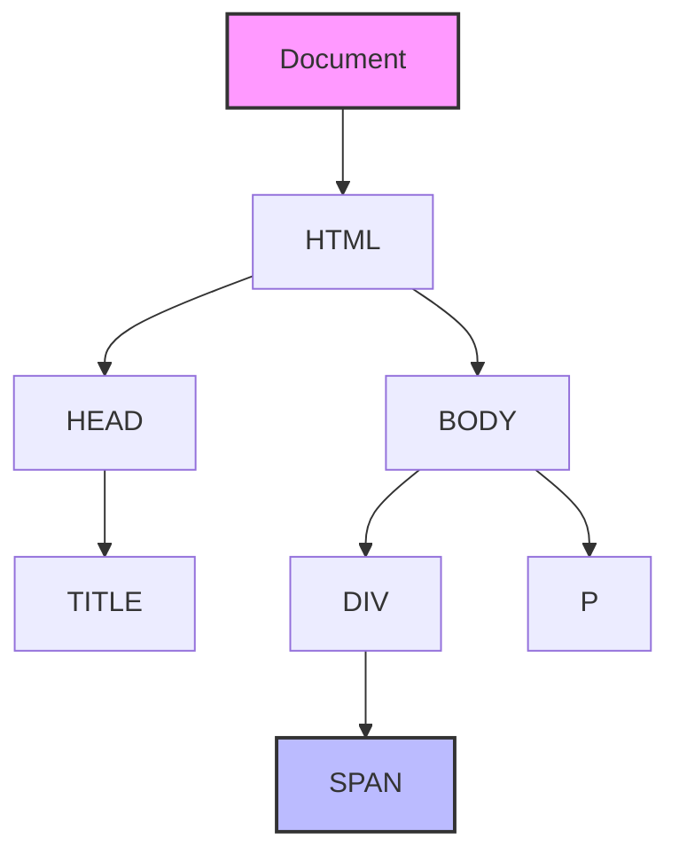
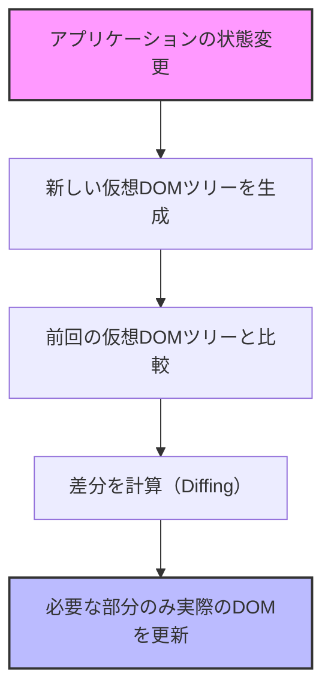
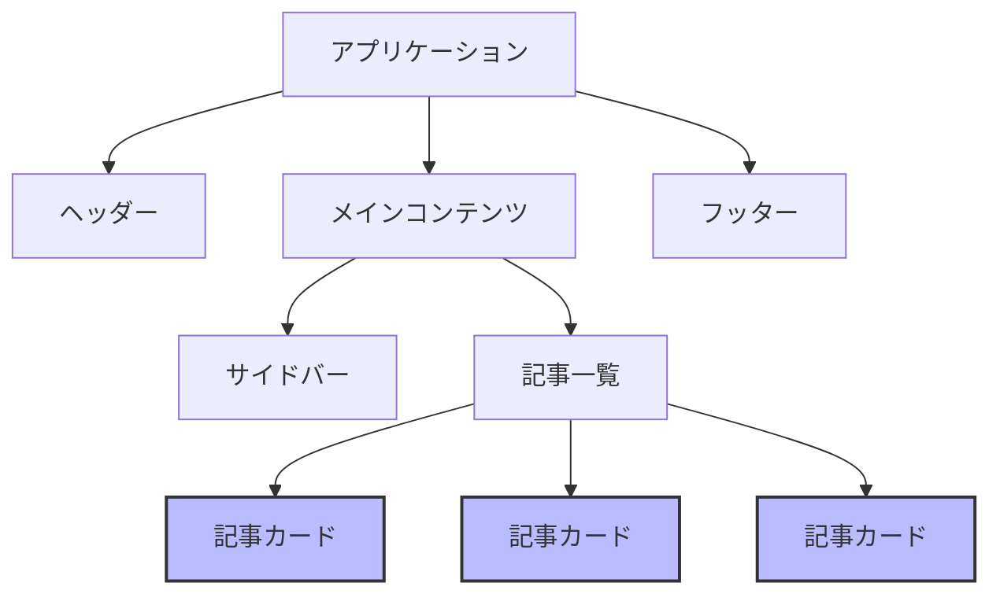

# TypeScript + React<br>ハンズオン講座

## 第4-8回：React でポケモン検索アプリ開発

<div class="pt-12">
  <span @click="$slidev.nav.next" class="px-2 py-1 rounded cursor-pointer" hover="bg-white bg-opacity-10">
    Press Space for next page <carbon:arrow-right class="inline"/>
  </span>
</div>

<div class="abs-br m-6 flex gap-2">
  <button @click="$slidev.nav.openInEditor()" title="Open in Editor" class="text-xl slidev-icon-btn opacity-50 !border-none !hover:text-white">
    <carbon:edit />
  </button>
</div>

<style>
h1 {
  background-color: #fff;
  background-image: none;
}
</style>

---
layout: section
---

# 出席確認✋️

---
layout: default
---

# 本日の内容

<Toc minDepth="2" maxDepth="2" />

<style>
h2 {
  margin: 1rem 0;
}
</style>

## 👉️ React の基本概念とJSX
## 👉️ React コンポーネントと型定義
## 👉️ ポケモン検索アプリ「Poke Search」のハンズオン

---
layout: section
---

# React の基本概念と JSX

---
layout: default
---

# React とは？

<div grid="~ cols-2 gap-4">
<v-clicks>
<div>

## React の概要

- Facebook が開発した JavaScript ライブラリ
- ユーザーインターフェイスを構築するための宣言的なアプローチ
- **コンポーネントベース**の設計思想
- データの変更に応じて効率的に再レンダリング
- 幅広いエコシステムと活発なコミュニティ
- モバイル（React Native）やデスクトップにも展開

</div>
<div>

## React の特徴

- **宣言的 UI**：「どのように」ではなく「何を」表示するかに集中
- **コンポーネント志向**：再利用可能な UI 部品
- **Learn Once, Write Anywhere**：多様なプラットフォームで活用可能
- **単方向データフロー**：予測可能な動作
- **JSX**：JavaScript の中に HTML ライクな構文
- **仮想 DOM**：効率的な更新メカニズム

</div>
</v-clicks>
</div>

---
layout: default
---

# DOM（Document Object Model）

<div grid="~ cols-2 gap-4">
<v-clicks>
<div>

## DOMとは

- HTMLドキュメントをツリー構造で表現したもの
- ブラウザがHTMLを解析して作成する
- 各要素（ノード）が親子関係で結ばれる
- JavaScriptから操作可能なAPIを提供
- 動的なWebアプリケーションの基盤


</div>
<div>

## DOMの特徴

- **ツリー構造**: 要素が階層的に配置される
- **動的更新**: JavaScriptで要素の追加・削除・変更が可能
- **イベント処理**: ユーザー操作に応答する仕組み
- **スタイル操作**: CSSの動的な変更が可能
- **クロスブラウザ**: 標準化されたAPIを提供

</div>
</v-clicks>
</div>

---
layout: default
---

# DOMの構造と操作

<div grid="~ cols-2 gap-4">

<div class="flex justify-center max-w-lg">

<v-clicks>



</v-clicks>

</div>

<v-clicks>

<div>

## DOMの基本操作

<br />

1. **要素の取得**: `getElementById`, `querySelector`など
2. **要素の作成**: `createElement`, `createTextNode`
3. **要素の追加**: `appendChild`, `insertBefore`
4. **要素の削除**: `removeChild`, `remove`
5. **属性の操作**: `setAttribute`, `getAttribute`

```javascript
// DOM操作の例
const div = document.createElement('div');
div.textContent = 'Hello, DOM!';
document.body.appendChild(div);
```

</div>
</v-clicks>
</div>

---
layout: default
---

# DOMのパフォーマンス課題

<div grid="~ cols-2 gap-4">
<v-clicks>
<div>

## DOM操作のコスト

<br />

- 要素の追加・削除は高コスト
- レイアウトの再計算が必要
- レンダリングの再実行が発生
- 頻繁な更新でパフォーマンス低下
- 複雑なUIでは特に影響大


</div>
<div>

## 一般的な解決策

<br />


- **バッチ処理**: 複数の更新をまとめる
- **最小限の更新**: 必要な部分のみ変更
- **DocumentFragment**: 仮想的な更新
- **requestAnimationFrame**: 最適なタイミングで更新
- **メモ化**: 不要な再計算を防ぐ

</div>
</v-clicks>
</div>

---
layout: default
---

# 仮想DOM（Virtual DOM）

<div grid="~ cols-2 gap-4">
<v-clicks>
<div>

## 仮想DOMとは


- 実際のDOMの軽量なコピー（JavaScriptオブジェクト）
- メモリ上に存在する仮想的な表現
- 実際のDOMとの変更を効率的に比較
- 必要な部分だけを更新（差分更新）


</div>
<div>

## 仮想DOMの利点


- **パフォーマンスの向上**：必要な箇所のみ更新
- **バッチ処理**：複数の変更をまとめて処理
- **クロスプラットフォーム**：DOM依存からの解放
- **宣言的コード**：命令的なDOM操作が不要
- **開発者体験の向上**：コンポーネントの状態に集中


</div>
</v-clicks>
</div>

---
layout: default
---

# 仮想DOMの仕組み

<div grid="~ cols-2 gap-4">

<div class="flex justify-center max-w-lg">

<v-clicks>



</v-clicks>

</div>

<v-clicks>

<div>

## 仮想DOMの処理フロー

<br />

1. **状態変更**: コンポーネントの状態（state/props）が変更される
2. **仮想DOM生成**: 新しい状態に基づいた仮想DOMツリーを生成
3. **差分検出（Reconciliation）**: 前回の仮想DOMツリーと比較
4. **最小限の更新計画**: 変更が必要な最小限の操作を特定
5. **実際のDOM更新**: 計画に基づいて実際のDOMを効率的に更新

</div>
</v-clicks>
</div>

---
layout: two-cols
---

# React での実装


<v-clicks>

<div>

## コード

```jsx
// ユーザーリストを表示するコンポーネント
const UserList = () => {
  const [users, setUsers] = React.useState([
    'Alice', 'Bob', 'Charlie'
  ]);

  const addUser = (name) => {
    setUsers([...users, name]);
  }

  return (
    <div>
      <ul>
        {users.map(user => (<li key={user}>{user}</li>))}
      </ul>
      <button onClick={() => addUser('Dave')}>
        Add User
      </button>
    </div>
  );
}
```

</div>
</v-clicks>

::right::

<v-clicks>

<div class="pl-8 mt-18">

## 特徴

- 宣言的 UI
- データとUIの自動同期
- コンポーネントとして再利用可能

</div>
</v-clicks>

---
layout: default
---

# コンポーネント指向の考え方

<div grid="~ cols-2 gap-4">
<div class="flex justify-center　max-w-lg">

<v-clicks>



</v-clicks>

</div>


<v-clicks>
<div>

## コンポーネント設計の利点

<br />

- **再利用性**: 同じコンポーネントを複数の場所で使用
- **保守性**: 特定の機能を担当するコードが集約される
- **テスト容易性**: コンポーネント単位でテスト可能
- **関心の分離**: 各コンポーネントが特定の役割に集中
- **並行開発**: チームで分担して開発可能
- **段階的UI構築**: 小さなコンポーネントから大きなシステムを構築

</div>
</v-clicks>
</div>

---
layout: section
---

# React の開発環境

---
layout: default
---

# Vite での React + TypeScriptプロジェクト構成

<div>

## プロジェクト作成方法


```bash
# プロジェクト作成
npm create vite@latest react-app-ts -- --template react-ts

# ディレクトリに移動
cd poke-search-ts

# 依存パッケージのインストール
npm install

# 開発サーバーの起動
npm run dev
```

</div>

---
layout: default
---

# メインエントリーポイントの解説

### main.tsx

```tsx {all|3-5|6-10}
import { StrictMode } from "react";
import { createRoot } from "react-dom/client";
import "./index.css";
import App from "./App.tsx";

createRoot(document.getElementById("root")!).render(
  <StrictMode>
    <App />
  </StrictMode>,
);

```

- `React`: Reactのコアライブラリ
- `ReactDOM`: ブラウザDOM操作用のライブラリ
- `createRoot`: React 18の新しいルートAPI
- `<React.StrictMode>`: 開発モードで追加チェックを有効化


---
layout: default
---

# ルートコンポーネントの解説

## App.tsx

```tsx {all|1-2|4-5,11,17|7-16}
import { useState } from "react";
import "./App.css";

function App() {
  const [count, setCount] = useState(0);

  return (
    <>
      <h1>Vite + React</h1>
      <div className="card">
        <button onClick={() => setCount((count) => count + 1)}>
          count is {count}
        </button>
      </div>
    </>
  );
}

export default App;
```

---
layout: default
---


# JSX の基本

<div grid="~ cols-2 gap-4">
<v-clicks>
<div>

## JSXとは

<br />

JSX（JavaScript XML）は、JavaScript の拡張構文で、React 要素を作成するための構文糖です。

```jsx
// JSXの例
const element = <h1>Hello, world!</h1>;

// 複数の要素
const content = (
  <div>
    <h1>タイトル</h1>
    <p>段落テキスト</p>
  </div>
);
```

</div>
<div>

## JSXの特徴

<br />

- HTMLライクな構文でUIを表現
- JavaScript式を `{}` で埋め込み可能
- 属性はキャメルケース（`className`, `onClick`など）
- 全ての要素は閉じる必要がある（``など）
- 複数要素は単一の親要素で囲む必要がある

</div>
</v-clicks>
</div>

---
layout: default
---

# JSX で式を使う

※以下，見やすさのために改行していますが，基本的には改行はしません．

<div grid="~ cols-2 gap-4">
<v-clicks>
<div>

## JSX に式を埋め込む

```jsx
const name = 'React';
const element = <h1>Hello, {name}!</h1>;

const user =
  { firstName: 'Harper', lastName: 'Perez' };
const greeting =
  <h1>Hello, {user.firstName} {user.lastName}!</h1>;

const getGreeting = (user) => {
  return user
    ? `Hello, ${user.name}!`
    : 'Hello, Stranger!';
};
const welcome = <h1>{getGreeting(user)}</h1>;
```

</div>
<div>

## 属性の設定

```jsx
// 文字列リテラル
const element = <div tabIndex="0"></div>;

// JavaScript式
const element = ;

// スタイルオブジェクト
const style = { color: 'red', fontSize: '16px' };
const element =
  <p style={style}>スタイル付きテキスト</p>;
```

</div>
</v-clicks>
</div>

---
layout: default
---

# TypeScript と JSXの連携

<div grid="~ cols-2 gap-4">
<v-clicks>
<div>

## TypeScript での JSX

```tsx
const name: string = 'React';
const element = <h1>Hello, {name}!</h1>;

type User = {
  firstName: string;
  lastName: string;
  age: number;
}

const user: User = {
  firstName: 'Harper',
  lastName: 'Perez',
  age: 25
};

const greeting = (
  <div>
    <h1>Hello, {user.firstName} {user.lastName}!</h1>
    <p>Age: {user.age}</p>
  </div>
);
```

</div>
<div>

## 型チェックの恩恵

- プロパティ名のタイプミスを検出
- 必要なプロパティの欠落を検出
- 誤った型の値の使用を防止

</div>
</v-clicks>
</div>

---
layout: default
---

# JSX の条件付きレンダリング

<div grid="~ cols-2 gap-4">
<v-clicks>
<div>

## 条件演算子（三項演算子）

```tsx
const isLoggedIn: boolean = true;

const greeting = (
  <div>
    {isLoggedIn
      ? <h1>Welcome back!</h1>
      : <h1>Please sign in.</h1>
    }
  </div>
);
```

</div>
<div>

## 論理演算子 `&&`

```tsx
const messages: string[] =
  ['React', 'TypeScript', 'Vite'];

const messageList = (
  <div>
    <h1>メッセージ一覧</h1>
    {messages.length > 0 && (
      <ul>
        {messages.map(message => (
          <li key={message}>{message}</li>
        ))}
      </ul>
    )}
  </div>
);
```

</div>
</v-clicks>
</div>

---
layout: default
---

# JSX でリストをレンダリングする

<div grid="~ cols-2 gap-4">
<v-clicks>
<div>

### `map` を使ったリストレンダリング

```tsx
type Item = {
  id: number;
  name: string;
}

const items: Item[] = [
  { id: 1, name: 'React' },
  { id: 2, name: 'TypeScript' },
  { id: 3, name: 'Vite' }
];

const itemList = (
  <ul>
    {items.map(item => (
      <li key={item.id}>{item.name}</li>
    ))}
  </ul>
);
```

</div>
<div>

### `key` の重要性

- 各リスト項目に一意の `key` プロパティが必要
- Reactが効率的にDOMを更新するために使用
- 通常は、データのIDを使用（インデックスは最後の手段）
- キーがないと警告が表示され、パフォーマンスに影響

</div>
</v-clicks>
</div>

---
layout: section
---

# Reactコンポーネントと型定義

---
layout: default
---

# 関数コンポーネントの基本

## 関数コンポーネントとは

関数コンポーネントは、PropsをインプットとしてJSX要素を返す純粋なJavaScript関数です💁

```tsx
function Welcome() {
  return <h1>Hello, World!</h1>;
}

// アロー関数での定義も可能
const Welcome = () => {
  return <h1>Hello, World!</h1>;
};

// 省略記法（暗黙のreturn）
const Welcome = () => <h1>Hello, World!</h1>;

// コンポーネントの使用
const App = () => (
  <div>
    <Welcome />
  </div>
);
```

---
layout: default
---

# Propsを受け取る関数コンポーネント

<div grid="~ cols-2 gap-4">
<v-clicks>
<div>

## Propsの基本

```tsx
// JavaScriptでのProps
function Welcome(props) {
  return <h1>Hello, {props.name}</h1>;
}

// 使用方法
<Welcome name="Alice" />
```

</div>
<div>

## TypeScript での Props

```tsx
// インライン型定義
function Welcome(props: { name: string }) {
  return <h1>Hello, {props.name}</h1>;
}

// インターフェイスを使用
type WelcomeProps = {
  name: string;
}

function Welcome(props: WelcomeProps) {
  return <h1>Hello, {props.name}</h1>;
}

// 使用方法
<Welcome name="Alice" />
```

</div>
</v-clicks>
</div>

---
layout: default
---

# 分割代入を使用したProps

<div grid="~ cols-2 gap-4">
<v-clicks>
<div>

## 分割代入の活用

```tsx
type WelcomeProps = {
  name: string;
  age?: number;  // オプショナルプロパティ
}

function Welcome({ name, age }: WelcomeProps) {
  return (
    <div>
      <h1>Hello, {name}!</h1>
      {age !== undefined && <p>Age: {age}</p>}
    </div>
  );
}

const App = () => (
  <div>
    <Welcome name="Alice" age={25} />
    <Welcome name="Bob" />
  </div>
);
```

</div>
<div>

## 分割代入の利点

- コード量の削減（`props.` の繰り返しを避ける）
- 使用するプロパティを明示的に示す
- デフォルト値の設定が容易

</div>
</v-clicks>
</div>

---
layout: default
---

# デフォルト値を持つProps

<div grid="~ cols-2 gap-4">
<div>

## デフォルト値の設定方法

```tsx
type GreetingProps = {
  name: string;
  greeting?: string;  // オプショナル
  showAge?: boolean;  // オプショナル
  age?: number;       // オプショナル
}

function Greeting({
  name,
  greeting = 'Hello',
  showAge = false,
  age = 30
}: GreetingProps) {
  return (
    <div>
      <h1>{greeting}, {name}!</h1>
      {showAge && <p>Age: {age}</p>}
    </div>
  );
}
```

</div>

<div class="mt-9">

```tsx
// （続き）
const App = () => (
  <div>
    <Greeting name="Alice" greeting="Welcome" showAge age={25} />
    <Greeting name="Bob" showAge />
    <Greeting name="Charlie" />
  </div>
);
```

</div>
</div>

---
layout: default
---

# 子要素を受け取るコンポーネント

<div grid="~ cols-2 gap-4">
<div>

## childrenプロパティ

```tsx
type CardProps = {
  title: string;
  children: React.ReactNode;  // 子要素の型
}

const Card = ({ title, children }: CardProps) => (
  <div className="card">
    <div className="card-header">
      <h2>{title}</h2>
    </div>
    <div className="card-body">
      {children}
    </div>
  </div>
);
```

</div>

<div class="mt-9">

```tsx
const App = () => (
  <div>
    <Card title="Welcome">
      <p>This is a card component.</p>
      <button>Click me</button>
    </Card>

    <Card title="Features">
      <ul>
        <li>TypeScript Support</li>
        <li>React Components</li>
        <li>Vite for development</li>
      </ul>
    </Card>
  </div>
);
```

</div>
</div>

---
layout: default
---

# イベントハンドリングとTypeScript

<div grid="~ cols-2 gap-4">
<v-clicks>
<div>

### イベント型の活用

```tsx
type ButtonProps = {
  label: string;
  onClick: (event: React.MouseEvent<HTMLButtonElement>) => void;
}

const Button = ({ label, onClick }: ButtonProps) => (
  <button onClick={onClick}>{label}</button>
);

const App = () => {
  const handleClick = (event: React.MouseEvent<HTMLButtonElement>) => {
    console.log('Button clicked!', event.currentTarget.innerText);
  };

  return (
    <div>
      <Button label="Click me" onClick={handleClick} />
    </div>
  );
};
```

</div>
<div>

### 主なイベント型

- `React.MouseEvent<HTMLElement>`
  - マウスイベント
- `React.ChangeEvent<HTMLInputElement>`
  - 入力変更イベント
- `React.FormEvent<HTMLFormElement>`
  - フォームイベント
- `React.KeyboardEvent<HTMLElement>`
  - キーボードイベント

</div>
</v-clicks>
</div>

---
layout: default
---

# フォーム要素とイベント処理

<div grid="~ cols-2 gap-4">
<div>

```tsx
import { useState, ChangeEvent, FormEvent } from 'react';

type FormData = {
  username: string;
  email: string;
}

const ContactForm = () => {
  // フォームデータの状態
  const [formData, setFormData] = useState<FormData>({
    username: '',
    email: ''
  });

  // 入力変更ハンドラー
  const handleChange = (e: ChangeEvent<HTMLInputElement>) => {
    const { name, value } = e.target;
    setFormData(prev => ({
      ...prev,
      [name]: value
    }));
  };
```

</div>

<div>

```tsx
  const handleSubmit = (e: FormEvent<HTMLFormElement>) => {
    e.preventDefault();  // デフォルトの送信動作を防止
    // ここでAPIリクエストなどの処理を行う
  };
  return (
    <form onSubmit={handleSubmit}>
      <div>
        <label htmlFor="username">Username:</label>
        <input
          value={formData.username}
          onChange={handleChange}
        />
      </div>
      <div>
        <label htmlFor="email">Email:</label>
        <input
          type="email"
          value={formData.email}
          onChange={handleChange}
        />
      </div>
      <button type="submit">Submit</button>
    </form>
  );
};
```

</div>
</div>

<style>
h1 {
  font-size: 1.2rem;
  margin-bottom: 0 !important;
}
</style>

---
layout: default
---

# コンポーネント設計パターン

<div grid="~ cols-2 gap-4">
<div>

### コンポーネント分類の考え方

<v-clicks>
<div>

**表示コンポーネント**（Presentational Components）
   - UI表示に特化
   - データをPropsとして受け取る
   - 通常、状態を持たない（または UI 状態のみ）
   - 再利用性が高い

</div>
<div>

**コンテナコンポーネント**（Container Components）
   - データ取得やロジックに特化
   - 表示コンポーネントにデータを提供
   - アプリケーションの状態管理
   - 副作用の処理（API呼び出しなど）

</div>
</v-clicks>
</div>

<div class="mt-10">
<v-clicks>
<div>

**高階コンポーネント**（Higher-Order Components, HOC）
   - コンポーネントを受け取り、拡張したコンポーネントを返す関数
   - 横断的関心事の分離（認証、ログなど）

</div>
<div>

**カスタムフック**
   - ロジックを抽出して再利用
   - コンポーネントとして設計されない状態とロジック

</div>
</v-clicks>
</div>
</div>

<style>
p {
  margin-bottom: 0;
}
</style>

---
layout: default
---


# 型定義の共有とエクスポート

<div grid="~ cols-2 gap-4">
<v-clicks>
<div>

### 型定義ファイルの作成

```tsx
// src/types/index.ts
export type User = {
  id: number;
  name: string;
  email: string;
  role: 'admin' | 'user';
}

export type Post = {
  id: number;
  title: string;
  content: string;
  author: User;
  createdAt: string;
}

export type Comment = {
  id: number;
  postId: number;
  text: string;
  author: User;
  createdAt: string;
}
```

</div>
<div>

### 型定義のインポート

```tsx
// src/components/UserList.tsx
import { User } from '../types';

type UserListProps = {
  users: User[];
  onUserSelect: (user: User) => void;
}

const UserList = ({ users, onUserSelect }: UserListProps) => {
  // コンポーネントの実装
};
```

<br />

### 型定義の集中管理の利点

- コードの一貫性を確保
- 型定義の重複を防止
- 変更が必要な場合、一箇所で対応可能
- チーム間での型の共有が容易

</div>
</v-clicks>
</div>

<style>
h1 {
  margin-bottom: 0 !important;
}
</style>

---
layout: default
---

# プロジェクト構造とコンポーネント分割

<div grid="~ cols-2 gap-4">
<div>

### 機能/役割ベースの構造

```
src/
├── components/             # 共通コンポーネント
│   ├── Button/
│   │   ├── Button.tsx
│   │   └── index.ts
│   ├── Card/
│   │   ├── Card.tsx
│   │   └── index.ts
│   └── ...
├── features/              # 機能別モジュール
│   ├── auth/              # 認証機能
│   │   ├── components/    # 認証関連コンポーネント
│   │   ├── hooks/         # 認証関連カスタムフック
│   │   ├── types.ts       # 認証関連の型定義
│   │   └── index.ts       # エクスポート
│   ├── users/             # ユーザー管理機能
│   └── ...
├── hooks/                 # グローバルカスタムフック
├── types/                 # 共通型定義
├── utils/                 # ユーティリティ関数
└── App.tsx                # ルートコンポーネント
```

</div>

<div>

### バレルファイル（index.ts）の活用

```typescript
// src/components/Button/index.ts
export * from './Button';
export { default } from './Button';

// インポート側
import Button from '@/components/Button';
```

</div>
</div>

---
layout: default
---

# コンポーネント設計の実践例

```tsx
import { ButtonHTMLAttributes } from 'react';

type ButtonProps = ButtonHTMLAttributes<HTMLButtonElement> & {
  variant?: 'primary' | 'secondary' | 'danger';
  size?: 'small' | 'medium' | 'large';
}

const Button = ({
  children,
  variant = 'primary',
  size = 'medium',
  className = '',
  ...rest
}: ButtonProps) => {
  const variantClass = `${baseClass}--${variant}`;
  const sizeClass = `${baseClass}--${size}`;

  return (
    <button className={`${variantClass} ${sizeClass} ${className}`} {...rest}>
      {children}
    </button>
  );
};
export default Button;
```

<style>
h1 {
  margin-bottom: 0 !important;
}
</style>

---
layout: default
---

# HTMLタグの属性を拡張する

<div grid="~ cols-2 gap-4">
<v-clicks>
<div>

```tsx
import { InputHTMLAttributes } from 'react';

type TextInputProps = InputHTMLAttributes<HTMLInputElement> & {
  label: string;
  error?: string;
}

const TextInput = ({
  label,
  error,
  id,
  className = '',
  ...rest
}: TextInputProps) => {
  // ユニークなIDを生成（idが提供されていない場合）
  const inputId = id || `input-${label.toLowerCase().replace(/\s+/g, '-')}`;

  return (
    <div className="form-field">
      <label htmlFor={inputId}>{label}</label>
      <!-- 続く -->
```

</div>
<div>

```tsx
      <!-- 続き -->
      <input
        id={inputId}
        className={`form-input ${error ? 'form-input--error' : ''} ${className}`}
        {...rest}
      />
      {error && <div className="form-error">{error}</div>}
    </div>
  );
};

const Form = () => (
  <form>
    <TextInput
      label="Username"
      placeholder="Enter your username"
      required
      minLength={3}
      value={username}
      onChange={handleChange}
      error={errors.username}
    />
  </form>
);
```

</div>
</v-clicks>
</div>

---
layout: default
---

# 制約付きProps（ジェネリクスの活用）①

<div grid="~ cols-2 gap-4">
<v-clicks>
<div>

```tsx
type SelectOption<T> = {
  label: string;
  value: T;
}
type SelectProps<T> = {
  options: SelectOption<T>[];
  value: T;
  onChange: (value: T) => void;
  label?: string;
  disabled?: boolean;
}

function Select<T extends string | number>({
  options,
  value,
  onChange,
  label,
  disabled = false
}: SelectProps<T>) {
  const handleChange = (e: React.ChangeEvent<HTMLSelectElement>) => {
    // 値の型を適切に変換
    const newValue = e.target.value as unknown as T;
    onChange(newValue);
  };
```

</div>
<div>

```tsx
  return (
    <div className="select-container">
      {label && <label>{label}</label>}
      <select
        value={value as unknown as string}
        onChange={handleChange}
        disabled={disabled}
      >
        {options.map(option => (
          <option key={String(option.value)} value={String(option.value)}>
            {option.label}
          </option>
        ))}
      </select>
    </div>
  );
}
```

</div>
</v-clicks>
</div>

---

# 制約付きProps（ジェネリクスの活用）②

<div grid="~ cols-2 gap-4">
<v-clicks>
<div>

```tsx
// 使用例（文字列値）
const StringSelect = () => {
  const [selectedColor, setSelectedColor] = useState<string>('red');
  const colorOptions: SelectOption<string>[] = [
    { value: 'red', label: 'Red' },
    { value: 'green', label: 'Green' },
    { value: 'blue', label: 'Blue' }
  ];

  return (
    <Select<string>
      options={colorOptions}
      value={selectedColor}
      onChange={setSelectedColor}
      label="Select Color"
    />
  );
};
```

</div>
<div>

```tsx
// 使用例（数値値）
const NumberSelect = () => {
  const [selectedId, setSelectedId] = useState<number>(1);
  const userOptions: SelectOption<number>[] = [
    { value: 1, label: 'User 1' },
    { value: 2, label: 'User 2' },
    { value: 3, label: 'User 3' }
  ];

  return (
    <Select<number>
      options={userOptions}
      value={selectedId}
      onChange={setSelectedId}
      label="Select User"
    />
  );
};
```

</div>
</v-clicks>
</div>

---
layout: default
---

# カスタムフックで再利用可能なロジック

<div grid="~ cols-2 gap-4">
<v-clicks>
<div>

```tsx
import { useState, useEffect } from 'react';

// ウィンドウサイズを監視するカスタムフック
function useWindowSize() {
  const [size, setSize] = useState({
    width: window.innerWidth,
    height: window.innerHeight
  });

  useEffect(() => {
    const handleResize = () => {
      setSize({
        width: window.innerWidth,
        height: window.innerHeight
      });
    };

    window.addEventListener('resize', handleResize);
    return () => window.removeEventListener('resize', handleResize);
  }, []);

  return size;
}
```

</div>
<div>

```tsx
// 使用例
const ResponsiveComponent = () => {
  const { width, height } = useWindowSize();

  return (
    <div>
      <h2>ウィンドウサイズ</h2>
      <p>幅: {width}px</p>
      <p>高さ: {height}px</p>
      {width < 768 && <p>モバイル表示</p>}
    </div>
  );
};
```

</div>
</v-clicks>
</div>

---
layout: default
---

# コンポーネントライブラリの活用


引用元: [https://ant.design/](https://ant.design/)
---

# コンポーネントライブラリの活用

<div grid="~ cols-2 gap-4">
<v-clicks>
<div>

```tsx
import { useState } from 'react';
import { Button, Select, Input, DatePicker } from 'antd';
import type { SelectProps } from 'antd/es/select';

const UserForm = () => {
  const [userName, setUserName] = useState('');
  const [role, setRole] = useState<string>('user');
  const [joinDate, setJoinDate] = useState<Date | null>(null);

  const roleOptions: SelectProps['options'] = [
    { value: 'admin', label: 'Administrator' },
    { value: 'user', label: 'Regular User' },
    { value: 'guest', label: 'Guest' }
  ];

  const handleSubmit = () => {
    console.log({
      userName,
      joinDate
    });
  };
```

</div>
<div>

```tsx
  return (
    <div style={{ maxWidth: '500px', margin: '0 auto' }}>
      <h2>User Information</h2>
      <div style={{ marginBottom: '16px' }}>
        <label>User Name:</label>
        <Input
          value={userName}
          onChange={e => setUserName(e.target.value)}
          placeholder="Enter user name"
        />
      </div>

      <div style={{ marginBottom: '16px' }}>
        <label>Join Date:</label>
        <DatePicker
          style={{ width: '100%' }}
          onChange={date => setJoinDate(date ? date.toDate() : null)}
        />
      </div>

      <Button type="primary" onClick={handleSubmit}>
        Save User
      </Button>
    </div>
  );
};
```

</div>
</v-clicks>
</div>

---
layout: section
---

# ポケモン検索アプリ<br>「Poke Search」ハンズオン

---

# 目次

## 1. プロジェクトの準備
## 2. 基本的なファイル構造の作成
## 3. 各コンポーネントの実装
## 4. APIクライアントの実装
## 5. TypeScript 型化 + ロジックの追加
## 6. カスタムフックの実装
## 7. アプリケーションの完成

※今回は先にアプリを実装して，後から TypeScript で型化します．

<style>
h2 {
  margin-bottom: .5rem;
}
</style>
---

# 1. プロジェクトの準備

## 1.1 プロジェクトの作成
まず、Viteを使用して新しいReact + TypeScriptプロジェクトを作成します。

```bash
# プロジェクトを作成
npm create vite@latest poke-search-ts -- --template react-ts

# プロジェクトディレクトリに移動
cd poke-search-ts

# 必要なパッケージをインストール
npm install

# 追加で必要なパッケージをインストール
npm install axios

# アプリを起動
npm run dev
```

---

## 1.2 プロジェクト構造の確認
プロジェクトを作成したら、以下のような構造になっているはずです：

```
poke-search-ts/
├── src/
│   ├── App.tsx
│   ├── App.css
│   ├── index.css
│   └── main.tsx
├── public/
├── eslint.config.js
├── index.html
├── package.json
├── README.md
├── tsconfig.json
├── tsconfig.app.json
├── tsconfig.node.json
└── vite.config.ts
```

---

## 1.3 初期化

いらないコードを削除します💁まずは `App.tsx` から．

```tsx
import "./App.css";

function App() {
  return (
    <>
      <h1>ポケモンサーチ</h1>
    </>
  );
}

export default App;
```

---

## 1.3 初期化（続き）

`index.html` にて ResetCSS を読み込みましょう．ついでに， `title` も変えちゃいます💁

```diff
  <head>
    <meta charset="UTF-8" />
    <link rel="icon" type="image/svg+xml" href="/vite.svg" />
    <meta name="viewport" content="width=device-width, initial-scale=1.0" />
+   <link rel="stylesheet" href="https://cdn.jsdelivr.net/npm/modern-css-reset" />
-   <title>Vite + React + TS</title>
+   <title>Pokemon Search</title>
  </head>
```

---

## 1.3 初期化

`index.css` を以下の記述のみ残し，残りは削除してください💁

```css
/* src/index.css */
:root {
  /* 省略しますが，記述は残します */
}

body {
  margin: 0;
  display: flex;
  place-items: center;
  min-width: 320px;
  min-height: 100vh;
}

@media (prefers-color-scheme: light) {
  :root {
    color: #213547;
    background-color: #ffffff;
  }
}
```

---

## 1.3 初期化

引き続き不要なスタイリングは削除します💁 `App.css` は以下の記述のみにしてください．

```css
/* src/App.css */
#root {
  max-width: 1280px;
  margin: 0 auto;
  padding: 2rem;
  text-align: center;
}

button {
  cursor: pointer;
}
```

---

# 2. 基本的なファイル構造の作成

## ディレクトリ構造の作成

以下のディレクトリ・ファイルを作成します：

```
src/
└── components/
    ├── SearchForm/
    │   ├── index.tsx
    │   └── style.css
    ├── SearchToggle/
    │   ├── index.tsx
    │   └── style.css
    └── PokemonCard/
        ├── index.tsx
        └── style.css
```

---

# 3. コンポーネントの実装

### 3.1 検索バーコンポーネントの作成

まずは関数コンポーネントとスタイリングのみ💁

```tsx
// src/components/SearchForm/index.tsx
const SearchForm = () => {
  // フォーム送信時の処理
  const handleSubmit = (e) => {
    e.preventDefault(); // デフォルトの送信動作を防止
    console.log("submit");
  };

  return (
    <form onSubmit={handleSubmit}>
      <input type="text" placeholder="Enter ID or Name" />
      <button type="submit">Search</button>
    </form>
  );
};

export default SearchForm;
```

---

### 3.1 検索バーコンポーネントの作成（続き）

書けましたら，`App.tsx` でインポートし，配置します💁

```diff
  import "./App.css";
+ import SearchForm from "./components/SearchForm";

  function App() {
    return (
      <>
        <h1>Vite + React</h1>
+       <SearchForm />
      </>
    );
  }
```

---

### 3.1 検索バーコンポーネントの作成（続き）

続いてスタイリングです．

```diff
+ import "./style.css";

// 省略

return (
- <form onSubmit={handleSubmit}>
+ <form onSubmit={handleSubmit} className="search-form">
    <input type="text" placeholder="Enter ID or Name" />
    <button type="submit">Search</button>
  </form>
);
```

新たにファイルを作成し以下を追記

```css
/* src/components/SearchForm/style.css */
.search-form {
  display: flex;
  width: 100%;
  max-width: 360px;
}
```

---

### 3.1 検索バーコンポーネントの作成（続き）

引き続き追記してください💁

<div grid="~ cols-2 gap-4">
<div>

```css
.search-form input {
  /* 余白をよしなに埋める */
  flex: 1;
  /* 入力欄内部に余白をいれる */
  padding: 12px 16px;
  /* 枠線の色を決める */
  border: 1px solid #ddd;
  /* 左上，左下を角丸に */
  border-radius: 8px 0 0 8px;
  /* 入力欄のテキストサイズを決める */
  font-size: 1rem;
  /* アニメーションを設定 */
  transition: border-color 0.3s;
}

.search-form input:focus {
  /* ※アクセシビリティの観点で良いとは言えない */
  outline: none;
  border-color: #3b5ca8;
}
```

</div>
<div class="mt--10">

```css
.search-form button {
  /* ボタン内部の余白 */
  padding: 12px 20px;
  /* ボタンの背景色と文字色を設定 */
  background-color: #e3350d;
  color: white;
  /* 枠線を消す */
  border: none;
  /* 右上，右下を角丸に */
  border-radius: 0 8px 8px 0;
  /* アニメーションを設定 */
  transition: background-color 0.3s;
  font-weight: bold;
}

/* マウスオーバーしたときのスタイル */
.search-form button:hover {
  background-color: #c62b09;
}

/* ボタンが非活性のときのスタイル */
.search-form button:disabled {
  background-color: #e38f7a;
  cursor: not-allowed;  /* マウスポインタも無効に */
}
```

</div>
</div>

---

### 3.2 検索トグルボタンコンポーネントの作成

引き続きコンポーネントを作っていきます．まずは基本的な構造から💁

```tsx
// src/components/SearchToggle/index.tsx
import "./style.css";

const SearchToggle = () => {
  return (
    <div className="search-toggle">
      <button type="button" className="name">
        Search by Name
      </button>
      <button type="button" className="id">
        Search by ID
      </button>
    </div>
  );
};

export default SearchToggle;
```

---

### 3.2 検索トグルボタンコンポーネントの作成（続き）

こちらも `App.tsx` でインポート，設置します．

```diff
  import "./App.css";
  import SearchForm from "./components/SearchForm";
+ import SearchToggle from "./components/SearchToggle";

  function App() {
    return (
      <>
        <h1>Vite + React</h1>
+       <SearchToggle />
        <SearchForm />
      </>
    );
```

---

### 3.2 検索トグルボタンコンポーネントの作成（続き）

<div grid="~ cols-2 gap-4">
<div>

```css
/* src/components/SearchToggle/style.css */
.search-toggle {
  display: flex;
  justify-content: center;
  margin-bottom: 20px;
  width: 100%;
}

.search-toggle button {
  background-color: #f2f2f2;
  border: none;
  color: #333;
  padding: 10px 0;
  transition: all 0.3s;
  font-size: 1rem;
  flex: 1;
  max-width: 180px;
}
```

</div>
<div>

```css
/* それぞれボタンの角丸を設定 */

.search-toggle button:first-child {
  border-radius: 8px 0 0 8px;
  border-right: none;
}

.search-toggle button:last-child {
  border-radius: 0 8px 8px 0;
  border-left: none;
}

/* ボタンがクリックされたときに適用するスタイル */
.search-toggle button.active {
  background-color: #3b5ca8;
  color: white;
  border-color: #3b5ca8;
  font-weight: bold;
}
```

</div>
</div>

---

### 3.3 PokemonCardコンポーネントの作成

データ表示用のPokemonCardコンポーネントを作成します．まずは基本的な構造から💁

<div grid="~ cols-2 gap-4">
<div>

```tsx
// src/components/PokemonCard/index.tsx
import "./style.css";

const PokemonCard = () => {
  return (
    <div className="pokemon-card">
      <div className="pokemon-image-grid">
        <div className="image-container">
          
          <span className="sprite-label">hoge</span>
        </div>
      </div>
      <div className="pokemon-info">
        <h2>Pokemon Name</h2>
        <p className="pokemon-id">#555</p>
        <div className="pokemon-types">
          <span className="type-badge">Flying</span>
        </div>
```

</div>
<div>

```tsx
        <div className="pokemon-details">
          <div className="detail-item">
            <span className="detail-label">Height:</span>
            <span>m</span>
          </div>
          <div className="detail-item">
            <span className="detail-label">Weight:</span>
            <span>kg</span>
          </div>
          <div className="detail-item">
            <span className="detail-label">Abilities:</span>
            <span>foo, bar, baz</span>
          </div>
        </div>
      </div>
    </div>
  );
};

export default PokemonCard;
```

</div>
</div>

---

### 3.3 PokemonCardコンポーネントの作成（続き）

続いてスタイリングを追加します💁

<div grid="~ cols-2 gap-4">
<div>

```css
/* src/components/PokemonCard/style.css */
.pokemon-card {
  display: flex;
  background-color: #fff;
  border-radius: 12px;
  /* はみ出したら隠す */
  overflow: hidden;
  /* 文字通り、ボックスに影をつける */
  box-shadow: 0 8px 20px rgba(0, 0, 0, 0.15);
  transition: transform 0.3s;
  width: 100%;
  margin-top: 24px;
}
```

</div>
<div>

```css
.image-container {
  display: flex;
  flex-direction: column;
  align-items: center;
  justify-content: center;
  padding: 10px;
  background-color: rgba(255, 255, 255, 0.7);
  border-radius: 8px;
  transition: transform 0.2s;
}
.image-container:hover {
  transform: scale(1.05);
  background-color: rgba(255, 255, 255, 0.9);
}

.pokemon-sprite {
  max-width: 96px;
  height: auto;
   /* ピクセルアートを鮮明に表示 */
  image-rendering: pixelated;
}
```

</div>
</div>

---

### 3.3 PokemonCardコンポーネントの作成（続き）

<div grid="~ cols-2 gap-4">
<div>

```css
.pokemon-card:hover {
  /* ちょっとY軸（上下）方向の上にずらす */
  transform: translateY(-5px);
}

.pokemon-image-grid {
  /* グリッドレイアウト */
  display: grid;
  /* ２列で幅120pxのトラックを配置 */
  grid-template-columns: repeat(2, 120px);
  /* ２行で高さを等間隔のトラックを配置 */
  grid-template-rows: repeat(2, 1fr);
  /* 上下左右に重なる部分の余白を設定 */
  gap: 10px;
  flex: 0 0 40%;
  /* 背景色をちょっとグラデーションをかける */
  background:
    linear-gradient(135deg, #f0f0f0 0%, #e0e0e0 100%);
  padding: 16px;
}
```

</div>
<div>

```css
.sprite-label {
  margin-top: 5px;
  font-size: 0.8rem;
  color: #666;
  text-align: center;
}

.pokemon-info {
  flex: 1;
  padding: 25px;
  background: linear-gradient(135deg, #ffffff 0%, #f7f7f7 100%);
  min-height: 220px; /* 最小の高さを確保 */
}

.pokemon-info h2 {
  margin-top: 0;
  color: #333;
  display: inline-block;
  margin-right: 10px;
  font-size: 1.8rem;
}
```

</div>
</div>

----

### 3.3 PokemonCardコンポーネントの作成（続き）

<div grid="~ cols-2 gap-4">
<div>

```css
.pokemon-id {
  display: inline-block;
  color: #777;
  font-size: 1.4rem;
  margin-top: 0;
  font-weight: bold;
}

.pokemon-types {
  margin: 20px 0;
}

.type-badge {
  display: inline-block;
  padding: 7px 14px;
  color: white;
  border-radius: 20px;
  margin-right: 8px;
  margin-bottom: 8px; /* 複数行になったときの余白 */
  font-size: 0.9rem;
  text-transform: capitalize;
  font-weight: bold;
  letter-spacing: 0.5px;
  box-shadow: 0 2px 4px rgba(0, 0, 0, 0.2);
}
```

</div>
<div>

```css
.pokemon-details {
  margin-top: 25px;
  background-color: #f9f9f9;
  padding: 15px;
  border-radius: 8px;
}

.detail-item {
  margin-bottom: 12px;
  font-size: 1rem;
  color: #555;
}

.detail-label {
  font-weight: bold;
  margin-right: 8px;
}
```

</div>
</div>

---

# 4. APIクライアントの実装

<div grid="~ cols-2 gap-4">
<div>

### 4.1 APIディレクトリの作成

まず、APIクライアント用のディレクトリとファイルを作成します💁

```
src/
└── api/
    └── pokemonApi.ts
```

</div>
<div>

### 4.2 基本的なAPIクライアントの実装

バリデーション機能付きのAPIクライアントを作成します：

```ts
import axios from "axios";

// 入力バリデーション用の正規表現
const NUMERIC_REGEX = /^\d+$/;
const NAME_REGEX = /^[a-zA-Z-]+$/;
const BASE_URL = "https://pokeapi.co/api/v2";

// PokeAPIからポケモンデータを取得する関数
export const fetchPokemonByName = async (name: string) => {
  // 名前は英字とハイフンのみ許可
  if (!NAME_REGEX.test(name)) {
    throw new Error(
      'Invalid name format. Only letters and hyphens are allowed.'
    );
  }
```

</div>
</div>

---

### 4.2 基本的なAPIクライアントの実装（続き）


```ts
  try {
    const response = await axios.get(`${BASE_URL}/pokemon/${name.toLowerCase()}`);
    return response.data;
  } catch (err) {
    console.error(err);
    throw err;
  }
};

export const fetchPokemonById = async (id: string) => {
  // IDは数字のみ許可
  if (!NUMERIC_REGEX.test(id)) {
    throw new Error('Invalid ID format. Only numbers are allowed.');
  }

  try {
    const response = await axios.get(`${BASE_URL}/pokemon/${id}`);
    return response.data;
  } catch (err) {
    console.error(err);
    throw err;
  }
};
```

---

### 4.3 SearchForm でAPIクライアントを使用

作成したAPIクライアントをSearchFormコンポーネントで使用してデータを取得してみましょう：

```diff
// src/components/SearchForm/index.tsx
  import "./style.css";
+ import { fetchPokemonById } from "../../api/pokemonApi";

  const SearchForm = () => {
-   const handleSubmit = (e) => {
+   const handleSubmit = async (e) => {
      e.preventDefault();
-     console.log('submit');
+     try {
+       // 検索タイプに応じてAPIを呼び分け（後で実装）
+       const result = await fetchPokemonById(e.target[0].value);
+       // データの構造を確認
+       console.log('ID:', result.id);
+       console.log('名前:', result.name);
+     } catch (e) {
+       console.error(e.message);
+     }
    };
```

APIでバリデーションが行われるため、エラーメッセージが表示されます💁

---

### 4.3 SearchForm でAPIクライアントを使用（続き）

PokemonCard コンポーネントを配置して表示する準備

```diff
+ import { useState } from 'react';
  import './style.css';
  import { fetchPokemonByName } from '../../api/pokemonApi';
+ import PokemonCard from '../PokemonCard';

  const SearchForm = () => {
+   const [pokemon, setPokemon] = useState(null);

    const handleSubmit = async (e) => {
      e.preventDefault(); // デフォルトの送信動作を防止
      try {
        const result = await fetchPokemonById(e.target[0].value);
+       setPokemon(result);
        console.log('ID:', result.id);
        console.log('名前:', result.name);
```

---

### 4.3 SearchForm でAPIクライアントを使用（続き）

```diff
    return (
+     <>
-     <form onSubmit={handleSubmit} className="search-form">
-       <input type="text" placeholder="Enter ID or Name" />
-       <button type="submit">Search</button>
-     </form>
+       <form onSubmit={handleSubmit} className="search-form">
+         <input type="text" placeholder="Enter ID or Name" />
+         <button type="submit">Search</button>
+       </form>
+      {pokemon && <PokemonCard pokemon={pokemon} />}
+     </>
    );
```

---

### 4.4 PokemonCard で取得した値を表示

```diff
  // src/components/PokemonCard/index.tsx
- const PokemonCard = () => {
+ const PokemonCard = ({ pokemon }) => {
    return (
      <div className="pokemon-card">
        <div className="pokemon-image-grid">
          <div className="image-container">
-           
-           <span className="sprite-label">hoge</span>
+           
+           <span className="sprite-label">Front Default</span>
          </div>
+         <div className="image-container">
+           
+           <span className="sprite-label">Back Default</span>
+         </div>
```

---

### 4.4 PokemonCard で取得した値を表示（続き）

```diff
+         <div className="image-container">
+           
+           <span className="sprite-label">Front Shiny</span>
+         </div>
+         <div className="image-container">
+           
+           <span className="sprite-label">Back Shiny</span>
+         </div>
        </div>
```

---

### 4.4 PokemonCard で取得した値を表示（続き）

```diff
        <div className="pokemon-info">
-         <h2>Pokemon Name</h2>
-         <p className="pokemon-id">#555</p>
+         <h2>{pokemon.name}</h2>
+         <p className="pokemon-id">#{pokemon.id}</p>
          <div className="pokemon-types">
-           <span className="type-badge">Flying</span>
+           {pokemon.types.map((typeInfo, index) => (
+             <span key={index} className="type-badge">
+               {typeInfo.type.name}
+             </span>
+           ))}
          </div>
```

---

### 4.4 PokemonCard で取得した値を表示（続き）

```diff
          <div className="pokemon-details">
            <div className="detail-item">
              <span className="detail-label">Height:</span>
-             <span>m</span>
+             <span>{(pokemon.height / 10).toFixed(1)}m</span>
            </div>
            <div className="detail-item">
              <span className="detail-label">Weight:</span>
-             <span>kg</span>
+             <span>{(pokemon.weight / 10).toFixed(1)}kg</span>
            </div>
            <div className="detail-item">
              <span className="detail-label">Abilities:</span>
-             <span>foo, bar, baz</span>
+             <span>
+               {pokemon.abilities
+                 .map((ability) => ability.ability.name)
+                 .join(", ")
+               }
+             </span>
            </div>
```

---

# 5. TypeScript型化 + ロジックの追加

これまでJavaScriptで実装してきたアプリケーションを、TypeScriptで型安全にしていきます💁

<div grid="~ cols-2 gap-4">
<div>

### 5.1 型定義ディレクトリの作成

まず、型定義用のディレクトリとファイルを作成します：

```
src/
└── types/
    └── pokemon.ts
```

</div>
<div>

### 5.2 基本的なPokemon型の定義

最小限のPokemon型から始めます：

```ts
// src/types/pokemon.ts
export type Pokemon = {
  id: number;
  name: string;
  height: number;
  weight: number;
}
```

</div>
</div>

---

### 5.3 APIクライアントの型化

既にバリデーション機能付きで型安全なAPIクライアントが実装済みです：

```diff
  // src/api/pokemonApi.ts
+ import type { Pokemon } from '../types/pokemon';

  // 入力バリデーション用の正規表現
  const NUMERIC_REGEX = /^\d+$/;
  const NAME_REGEX = /^[a-zA-Z-]+$/;
  const BASE_URL = 'https://pokeapi.co/api/v2';

- export const fetchPokemonByName = async (name: string) => {
+ export const fetchPokemonByName = async (name: string): Promise<Pokemon> => {
    if (!NAME_REGEX.test(name)) {
      throw new Error(
        'Invalid name format. Only letters and hyphens are allowed.'
      );
    }

    try {
-     const response = await axios.get(`${BASE_URL}/pokemon/${name.toLowerCase()}`);
+     const response = await axios.get<Pokemon>(`${BASE_URL}/pokemon/${name.toLowerCase()}`);
      console.log('APIレスポンス:', response.data);
      return response.data; // 型安全な戻り値
```

---

### 5.3 APIクライアントの型化（続き）

```diff
- export const fetchPokemonById = async (id: string) => {
+ export const fetchPokemonById = async (id: string): Promise<Pokemon> => {
    if (!NUMERIC_REGEX.test(id)) {
      throw new Error(
        'Invalid id format. Only letters and hyphens are allowed.'
      );
    }

    try {
-     const response = await axios.get(`${BASE_URL}/pokemon/${id}`);
+     const response = await axios.get<Pokemon>(`${BASE_URL}/pokemon/${id}`);
      console.log('APIレスポンス:', response.data);
      return response.data; // 型安全な戻り値
```

---

### 5.4 SearchToggle型の定義

SearchToggleコンポーネントで使用する型を定義します：

```diff
// src/types/pokemon.ts
  export type Pokemon = {
    id: number;
    name: string;
    height: number;
    weight: number;
  }

+ export type SearchType = "name" | "id";
```

---

### 5.5 SearchToggleコンポーネントの型化

SearchToggleコンポーネントにTypeScript型を追加します：

```diff
  // src/components/SearchToggle/index.tsx
  import "./style.css";
+ import type { SearchType } from "../../types/pokemon";

+ type SearchToggleProps = {
+   searchType: SearchType;
+   onTypeChange: (type: SearchType) => void;
+ }

- const SearchToggle = () => {
+ const SearchToggle: = ({ searchType, onTypeChange }: SearchToggleProps) => {
    return (
      <div className="search-toggle">
-       <button type="button" className="name">
+       <button
+         type="button"
+         className={`name ${searchType === "name" ? "active" : ""}`}
+         onClick={() => onTypeChange("name")}
+       >
          Search by Name
        </button>
```

---

### 5.5 SearchToggleコンポーネントの型化（続き）

```diff
-       <button type="button" className="id">
+       <button
+         type="button"
+         className={`id ${searchType === "id" ? "active" : ""}`}
+         onClick={() => onTypeChange("id")}
+       >
          Search by ID
        </button>
      </div>
    );
  };
```

---

### 5.6 App.tsxでの状態管理

App.tsxで状態を管理し、SearchToggleコンポーネントにpropsを渡します：


```diff
// src/App.tsx
+ import { useState } from "react";
  import "./App.css";
  import SearchForm from "./components/SearchForm";
  import SearchToggle from "./components/SearchToggle";
+ import type { SearchType } from "./types/pokemon";

  function App() {
+   const [searchType, setSearchType] = useState<SearchType>("name");

    return (
      <>
        <h1>ポケモンサーチ</h1>
-       <SearchToggle />
+       <SearchToggle
+         searchType={searchType}
+         onTypeChange={setSearchType}
+       />
        <SearchForm />
      </>
    );
  }
```

---

### 5.7 PokemonCardコンポーネントの型化

#### 5.7.1 詳細なPokemon型定義の拡張

現在の基本的なPokemon型では不十分なので、実際に使用するプロパティを追加します：

<div grid="~ cols-2 gap-4">
<div>

```diff
// src/types/pokemon.ts
  export type Pokemon = {
    id: number;
    name: string;
    height: number;
    weight: number;
+   sprites: {
+     front_default: string | null;
+     back_default: string | null;
+     front_shiny: string | null;
+     back_shiny: string | null;
+   };
+   types: {
+     type: {
+       name: string;
+       url: string;
+     };
+   }[];
```

</div>
<div>

```diff
+   abilities: {
+     ability: {
+       name: string;
+       url: string;
+     };
+   }[];
  }

  export type SearchType = "name" | "id";
```

</div>
</div>

---

#### 5.7.2 PokemonCardコンポーネントの型化

詳細な型定義を適用してコンポーネントを型安全にします：

```diff
// src/components/PokemonCard/index.tsx
  import "./style.css";
+ import type { Pokemon } from "../../types/pokemon";

+ type PokemonCardProps = {
+   pokemon: Pokemon;
+ }

- const PokemonCard = ({ pokemon }) => {
+ const PokemonCard = ({ pokemon }: PokemonCardProps) => {
    return (
      <div className="pokemon-card">
```

---

### 5.8 SearchFormコンポーネントの型化

<div grid="~ cols-2 gap-4">
<div>

```diff
  // src/components/SearchForm/index.tsx
+ import type { FormEvent, ChangeEvent } from 'react';
+ import type { SearchType, Pokemon } from '../../types/pokemon';

+ type SearchFormProps = {
+   searchTerm: string;
+   searchType: SearchType;
+   onSearchTermChange: (term: string) => void;
+ };

- const SearchForm = () => {
+ const SearchForm = ({
+   searchTerm,
+   searchType,
+   onSearchTermChange,
+ }: SearchFormProps) => {
- const [pokemon, setPokemon] = useState(null);
+ const [pokemon, setPokemon] = useState<Pokemon | null>(null);

-   const handleSubmit = async (e) => {
+   const handleSubmit = async (e: FormEvent<HTMLFormElement>) => {

+   const handleTermChange = (e: ChangeEvent<HTMLInputElement>) => {
+     onSearchTermChange(e.target.value);
+   };
```

</div>
<div>

```diff

  return (
    <>
      <form onSubmit={handleSubmit} className="search-form">
-       <input type="text" placeholder="Enter ID or Name">
+       <input
+         type={searchType === 'id' ? 'number' : 'text'}
+         placeholder={
+           searchType === 'name'
+             ? 'Enter name (e.g. pikachu)'
+             : 'Enter ID (e.g. 25)'
+         }
+         value={searchTerm}
+         onChange={handleTermChange}
+       />
        <button type="submit">Search</button>
      </form>
      {pokemon && <PokemonCard pokemon={pokemon} />}
    </>
  );
};

export default SearchForm;
```

</div>
</div>

---

### 5.8 SearchFormコンポーネントの型化（続き）

`App.tsx` から値を渡し，表示を確認

```diff
// src/App.tsx
  function App() {
    const [searchType, setSearchType] = useState<SearchType>("name");
+   const [searchTerm, setSearchTerm] = useState<string>("");

    return (
      <>
        <h1>ポケモンサーチ</h1>
        <SearchToggle
          searchType={searchType}
          onTypeChange={setSearchType}
        />
-       <SearchForm />
+       <SearchForm
+         searchType={searchType}
+         searchTerm={searchTerm}
+         onSearchTermChange={setSearchTerm}
+       />
```

---

# 6. カスタムフックの実装

型安全なデータ取得のロジックをカスタムフックとして抽出します💁

### 6.1 カスタムフックとは

カスタムフックは、ロジックを再利用可能な形で抽出するReactの仕組みです：

- 状態管理とロジックをコンポーネントから分離
- 複数のコンポーネントで同じロジックを共有
- テストしやすくなる
- コンポーネントがシンプルになる

---

### 6.2 usePokemonSearchフックの作成（Step by Step）

```
src/
└── hooks/
    └── usePokemonSearch.ts
```

<br />

#### Step 1: 基本的な検索機能のみ

<div grid="~ cols-2 gap-4">
<div>

```ts
import { useState, useCallback } from 'react';
import { fetchPokemonById, fetchPokemonByName } from '../api/pokemonApi';
import type { Pokemon, SearchType } from '../types/pokemon';

type UsePokemonSearchReturn = {
  pokemon: Pokemon | null;
  searchPokemon: (query: string, type: SearchType) => Promise<Pokemon | null>;
  clearResults: () => void;
}

export const usePokemonSearch = (): UsePokemonSearchReturn => {
  const [pokemon, setPokemon] = useState<Pokemon | null>(null);

  const searchPokemon = useCallback(async (query: string, type: SearchType): Promise<Pokemon | null> => {
    if (!query.trim()) {
      return null;
    }
```

</div>
<div>

```ts
    const result = type === 'id'
      ? await fetchPokemonById(query)
      : await fetchPokemonByName(query);

    setPokemon(result);
    return result;
  }, []);

  const clearResults = () => {
    setPokemon(null);
  };

  return {
    pokemon,
    searchPokemon,
    clearResults
  };
};
```

</div>
</div>

---

#### Step 2: エラーハンドリングを追加

次にエラーハンドリングを追加します。

```diff
+ const [error, setError] = useState<string | null>(null);

  const searchPokemon = useCallback(async (query: string, type: SearchType): Promise<Pokemon | null> => {
    if (!query.trim()) {
+     setError('検索条件を入力してください');
      return null;
    }

+   setError(null);
+
+   try {
      // 中略
+   } catch (err) {
+     setError(err.message || 'ポケモンが見つかりませんでした');
+     return null;
+   }
  }, []);

  const clearResults = () => {
    setPokemon(null);
+   setError(null);
  };
```

---

#### Step 3: ローディング処理を追加

検索中の状態を管理するローディング処理を追加します。

```diff
+ const [isLoading, setIsLoading] = useState<boolean>(false);

  const searchPokemon = useCallback(async (query: string, type: SearchType): Promise<Pokemon | null> => {
    if (!query.trim()) {
      setError('検索条件を入力してください');
      return null;
    }

+   setIsLoading(true);
    setError(null);
+   setPokemon(null);

    try {
      // 中略
    } catch (err) {
      setError('ポケモンが見つかりませんでした');
      return null;
+   } finally {
+     setIsLoading(false);
+   }
  }, []);
```

---

#### Step 4: TypeScriptによる型化を追加

最終的に完全な型定義を追加します。

```diff
- type UsePokemonSearchReturn = {
-   pokemon: Pokemon | null;
-   searchPokemon: (query: string, type: SearchType) => Promise<Pokemon | null>;
-   clearResults: () => void;
- }
+ type UsePokemonSearchReturn = {
+   pokemon: Pokemon | null;
+   isLoading: boolean;
+   error: string | null;
+   searchPokemon: (query: string, type: SearchType) => Promise<Pokemon | null>;
+   clearResults: () => void;
+ }
```

---

#### Step 5: `return` の追加

このカスタムフックがレスポンスするものを追加します．

```diff
  return {
    pokemon,
+   isLoading,
+   error,
    searchPokemon,
    clearResults
  };
};
```

---

# 7. アプリケーションの完成

### 7.1 App.tsx での状態管理統合

5.7で実装したSearchFormの複雑なロジックをApp.tsxに移管し、適切な関心の分離を行います：

<div grid="~ cols-2 gap-4">
<div>

```diff
// src/App.tsx
+ import type { FormEvent } from 'react';
  import { useState } from 'react';
  import './App.css';
+ import PokemonCard from './components/PokemonCard';

  const App = () => {
    const [searchTerm, setSearchTerm] = useState<string>('');
    const [searchType, setSearchType] = useState<SearchType>('name');
+   const { pokemon, isLoading, error, searchPokemon, setPokemon, setError } =
+     usePokemonSearch();
```

</div>
<div>

**App.tsx での責務**

- グローバルな状態管理
- 検索実行の制御
- コンポーネント間の連携
- エラーハンドリング

**handleTypeChange の役割**

- 検索タイプ変更時の状態リセット
- 入力値・結果・エラーの初期化
- SearchTypeToggle に props として渡す

</div>
</div>

<style>
  .slidev-layout li {
    line-height: 1;
  }
</style>

---

### 7.1 App.tsx での状態管理統合（続き）

SearchFormのロジックをApp.tsxに移管：

<div grid="~ cols-2 gap-4">
<div>

```ts
  // フォーム送信ハンドラ
  const handleSubmit = async (e: FormEvent) => {
    e.preventDefault();

    // 検索実行
    await searchPokemon(searchTerm, searchType);

    // 検索が完了したら入力フォームをクリア
    setSearchTerm('');
  };

  // 検索タイプが変更された時に入力をクリア
  const handleTypeChange = (type: SearchType) => {
    setSearchTerm('');
    setSearchType(type);
    clearResults();
  };
```

</div>
<div>

```diff
  return (
    <div className="app">
      <h1>Poké Search</h1>
      <p className="description">Search for a Pokémon by name or ID</p>

      <SearchToggle
        searchType={searchType}
-       onTypeChange={setSearchType}
+       onTypeChange={handleTypeChange}
      />

      <SearchForm
        // 中略
+       isLoading={isLoading}
+       onSubmit={handleSubmit}
      />

+     {error && <div className="error-message">{error}</div>}
+     {pokemon && !isLoading && <PokemonCard pokemon={pokemon} />}
    </div>
  );
};
```

</div>
</div>

---

### 7.1 App.tsx での状態管理統合（続き）

エラーメッセージの装飾をします．

```css
/* src/App.css */
.error-message {
  padding: 15px;
  background-color: #ffe6e6;
  color: #d32f2f;
  border-radius: 8px;
  margin-top: 16px;
  margin-bottom: 20px;
  text-align: center;
  font-weight: bold;
  box-shadow: 0 2px 4px rgba(0, 0, 0, 0.05);
}
```

---

### 7.2 SearchForm の簡素化

5.7で実装した複雑なロジックを App.tsx に移管後の SearchForm の簡素化：

<div grid="~ cols-2 gap-4">
<div>

```diff
// src/components/SearchForm.tsx
- import { useState } from 'react';
  import type { FormEvent, ChangeEvent } from 'react';
- import type { SearchType, Pokemon } from '../types/pokemon';
+ import type { SearchType } from '../types/pokemon';
  import './style.css';
- import { fetchPokemonById } from '../../api/pokemonApi';
- import PokemonCard from '../PokemonCard';

  type SearchFormProps = {
    searchTerm: string;
    searchType: SearchType;
+   isLoading: boolean;
    onSearchTermChange: (term: string) => void;
+   onSubmit: (e: FormEvent) => void;
  };
```

</div>
<div>

```diff
  const SearchForm = ({
    searchTerm,
    searchType,
+   isLoading,
    onSearchTermChange,
+   onSubmit,
  }) => {
-   const [pokemon, setPokemon] = useState<Pokemon | null>(null);

-   const handleSubmit = async (e: FormEvent<HTMLFormElement>) => {
-     // 省略
-   };

```

</div>
</div>

---

### 7.2 SearchForm の簡素化（続き）

シンプルなフォーム表示に特化：

<div grid="~ cols-2 gap-4">
<div>

```diff
  return (
-   <>
-     <form onSubmit={handleSubmit} className="search-form">
-       <input
-         // 中略
-       />
-       <button type="submit">Search</button>
-     </form>
-     {pokemon && <PokemonCard pokemon={pokemon} />}
-   </>
+   <form onSubmit={onSubmit} className="search-form">
+     <input
+       // 中略
+       min={searchType === 'id' ? 1 : undefined}
+     />
+     <button type="submit" disabled={isLoading}>
+       {isLoading ? 'Searching...' : 'Search'}
+     </button>
+   </form>
  );
};
```

</div>
<div>

**関心の分離の結果**

✅ **SearchForm**
- フォーム表示のみに集中
- Propsでデータを受け取る
- シンプルで再利用可能

✅ **App.tsx**
- アプリケーション全体の状態管理
- 検索ロジックの制御
- コンポーネント間の連携

✅ **保守性向上**
- 各コンポーネントの責務が明確
- テストしやすい構造
- 機能追加が容易

</div>
</div>


<style>
  .slidev-layout li {
    line-height: 1;
  }
</style>

---

### 7.3 SkeletonLoader コンポーネントの実装

データ読み込み中の表示用コンポーネントを作成：

<div grid="~ cols-2 gap-4">
<div>

```tsx
// src/components/SkeletonLoader.tsx
import './style.css';

const SkeletonLoader = () => {
  return (
    <div className="skeleton-loader">
      <div className="skeleton-image"></div>
      <div className="skeleton-content">
        <div className="skeleton-title"></div>
        <div className="skeleton-text"></div>
        <div className="skeleton-text short"></div>
        <div className="skeleton-badges">
          <div className="skeleton-badge"></div>
          <div className="skeleton-badge"></div>
        </div>
      </div>
    </div>
  );
};

export default SkeletonLoader;
```

</div>
<div>

```css
/* src/components/SkeletonLoader.css */
.skeleton-loader {
  border: 2px solid #f0f0f0;
  border-radius: 12px;
  padding: 20px;
  background: white;
  box-shadow: 0 4px 6px rgba(0, 0, 0, 0.1);
  animation: pulse 1.5s ease-in-out infinite;
}
.skeleton-image {
  width: 150px;
  height: 150px;
  background: #e0e0e0;
  border-radius: 8px;
  margin: 0 auto 16px;
}

.skeleton-title {
  height: 24px;
  background: #e0e0e0;
  border-radius: 4px;
  margin-bottom: 12px;
}
```

</div>
</div>

---

### 7.3 SkeletonLoader コンポーネントの配置

App.tsx に作成した SkeltonLoader コンポーネントを配置します．

```diff
  import SearchToggle from './components/SearchToggle';
  import PokemonCard from './components/PokemonCard';
+ import SkeletonLoader from './components/SkeltonLoader';
  import type { SearchType } from './types/pokemon';

  // 中略

    {error && <div className="error-message">{error}</div>}
+   {isLoading && <SkeletonLoader />}
    {pokemon && !isLoading && <PokemonCard pokemon={pokemon} />}
  </>
```

---

### 7.4 ポケモンタイプのカラーリング機能

タイプ別カラー表示の実装：

<div grid="~ cols-2 gap-4">
<div>

```tsx
// src/utils/typeColors.ts
export const typeColors: Record<string, string> = {
  normal: '#A8A878',
  fire: '#F08030',
  water: '#6890F0',
  electric: '#F8D030',
  grass: '#78C850',
  ice: '#98D8D8',
  fighting: '#C03028',
  poison: '#A040A0',
  ground: '#E0C068',
  flying: '#A890F0',
  psychic: '#F85888',
  bug: '#A8B820',
  rock: '#B8A038',
  ghost: '#705898',
  dragon: '#7038F8',
  dark: '#705848',
  steel: '#B8B8D0',
  fairy: '#EE99AC'
};
```

</div>
<div>

```diff
// src/components/PokemonCard.tsx
+ import { typeColors } from '../utils/typeColors';

  <div className="pokemon-types">
    {pokemon.types.map((typeInfo) => (
      <span
        key={typeInfo.type.name}
        className="type-badge"
+       style={{ backgroundColor: typeColors[typeInfo.type.name] || '#68A090' }}
      >
        {typeInfo.type.name}
      </span>
    ))}
  </div>
```

</div>
</div>

---

### 7.5 pokemonApi でのバリデーション の統合

API クライアント層でのバリデーション機能を実装：

<div grid="~ cols-2 gap-4">
<div>

```ts
// src/types/pokemon.ts
export type ApiError = {
  message: string;
  status: number | undefined;
};
```

</div>
<div>

```diff
// src/api/pokemonApi.ts
  import axios, { AxiosError } from "axios";
- import type { Pokemon } from "../types/pokemon";
+ import type { Pokemon, ApiError, SearchType } from "../types/pokemon";

  const BASE_URL = 'https://pokeapi.co/api/v2';

+ type ValidationResult = {
+   isValid: boolean;
+   errorMessage: string;
+ };

+ const validateInput = (query: string, type: SearchType): ValidationResult => {
+   if (!query.trim()) {
+     return {
+       isValid: false,
+       errorMessage:
+         type === 'name'
+           ? 'ポケモン名を入力してください'
+           : 'ポケモン ID を入力してください'
+     };
+   }
```

</div>
</div>

---

### 7.5 pokemonApi でのバリデーションの統合（続き）

<div grid="~ cols-2 gap-4">
<div>

```diff
+   if (type === 'name') {
+     if (query.length < 2) {
+       return { isValid: false, errorMessage: '2文字以上で入力してください' };
+     }
+     if (!NAME_REGEX.test(query)) {
+       return { isValid: false, errorMessage: '英字のみ入力可能です' };
+     }
+   } else {
+     if (!NUMERIC_REGEX.test(query) || parseInt(query, 10) < 1) {
+       return { isValid: false, errorMessage: '1以上の数値を入力してください' };
+     }
+   }
+
+   return { isValid: true, errorMessage: '' };
+ };
```

</div>
<div>

```diff
  export const fetchPokemonByName = async (name: string): Promise<Pokemon> => {
-   // 名前は英字とハイフンのみ許可
-   if (!NAME_REGEX.test(name)) {
-     throw new Error(
-       'Invalid name format. Only letters and hyphens are allowed.',
-     );
-   }
+   // API 呼び出し前のバリデーション
+   const validation = validateInput(name, "name");
+   if (!validation.isValid) {
+     const validationError: ApiError = {
+       message: validation.errorMessage,
+       status: 400
+     };
+     throw validationError;
+   }
+
```

</div>
</div>

---

### 7.5 pokemonApi でのバリデーションの統合（続き）

**設計の利点**

- **責任の分離**: API クライアントがデータの整合性を保証
- **早期検証**: ネットワーク呼び出し前にエラーを検出
- **統一されたエラーハンドリング**: バリデーションエラーも ApiError 型で統一
- **再利用性**: どこから呼び出されても同じバリデーション規則が適用
- **パフォーマンス**: 無効なリクエストでのネットワーク負荷軽減

**バリデーションルール**

- **名前検索**: 英字のみ、2文字以上
- **ID 検索**: 1-1010の数値のみ
- **共通**: 空入力チェック、型に応じたメッセージ

---

### 7.6 型安全なエラーハンドリングと fetch の統合

エラー型を使った安全な API クライアントに修正:

<div grid="~ cols-2 gap-4">
<div>

```diff
// src/api/pokemonApi.ts
  import axios, { AxiosError } from "axios";
+ import type { Pokemon, SearchType, ApiError } from "../types/pokemon";

  const BASE_URL = 'https://pokeapi.co/api/v2';

- export const fetchPokemonByName = async (name: string): Promise<Pokemon | null> => {
+ export const fetchPokemon = async (query: string, type: SearchType): Promise<Pokemon> => {
-   const validation = validateInput(name, 'name');
+   const validation = validateInput(query, type);

    // 中略

    try {
      const response =
-       await axios.get<Pokemon>(`${BASE_URL}/pokemon/${term.toLowerCase()}`);
+       await axios.get<Pokemon>(`${BASE_URL}/pokemon/${query.toLowerCase()}`);
      return response.data;
    } catch (error) {
-     console.error(error);
-     throw err;
```

</div>
<div>

```diff
+     if (error instanceof AxiosError) {
+       const apiError: ApiError = {
+         message: error.response?.status === 404
+           ? `ポケモン "${query}" が見つかりません`
+           : 'APIエラーが発生しました',
+         status: error.response?.status
+       };
+       throw apiError;
+     }
    }
  };

- export const fetchPokemonById = async (id: string): Promise<Pokemon | null> => {
-  // 全削除
- }
```

</div>
</div>

---

### 7.6 型安全なエラーハンドリングと fetch の統合

```diff
// src/hooks/usePokemonSearch.ts
  import { useState, useCallback } from 'react';
- import { fetchPokemonById, fetchPokemonByName } from '../api/pokemonApi';
+ import { fetchPokemon } from '../api/pokemonApi';
  import type { Pokemon, SearchType } from '../types/pokemon';

  // 中略

      try {
-       const result =
-         type === 'id'
-           ? await fetchPokemonById(query)
-           : await fetchPokemonByName(query);
+       const result = await fetchPokemon(query, type);
```

---

### 7.7 型安全なカスタムフック

型付きカスタムフックの実装：

```diff
// src/hooks/usePokemonSearch.ts
export const usePokemonSearch = () => {
  const [pokemon, setPokemon] = useState<Pokemon | null>(null);
  const [isLoading, setIsLoading] = useState<boolean>(false);
- const [error, setError] = useState<string | null>(null);
+ const [error, setError] = useState<{ isError: boolean; message: string }>({
+   isError: false,
+   message: ''
+ });

  type UsePokemonSearchReturn = {
    // 他省略
-   error: string | null;
+   error: { isError: boolean; message: string };
  };

  const searchPokemon = useCallback(async (query: string, type: SearchType): Promise<Pokemon | null> => {
    if (!query.trim()) {
-     setError('Please enter id or name correctly');
+     setError({
+       isError: true,
+       message: 'Please enter id or name correctly',
+     });
```

---

### 7.7 型安全なカスタムフック（続き）

```diff
    setIsLoading(true);
-   setError(null);
+   setError({ isError: false, message: '' });

  // 中略

    } catch (err) {
      const apiError = err as ApiError;
-     setError("ポケモンが見つかりませんでした");
+     setError({ isError: true, message: apiError.message });
      return null;


  const clearResults = () => {
    setPokemon(null);
-   setError(null);
+   setError({ isError: false, message: '' });
  };

  return {
    // 他省略
+   setError: (error: { isError: boolean; message: string }) => setError(error),
    clearResults
+ };
};
```

---

### 7.7 型安全なカスタムフック（続き）

```diff
// srcApp.tsx
- {error && <div className="error-message">{error}</div>}
+ {error.isError && <div className="error-message">{error.message}</div>}
  {isLoading && <SkeletonLoader />}
  {pokemon && !isLoading && <PokemonCard pokemon={pokemon} />}
```

---

### 7.8 デザインの調整

#### ①アプリをカードっぽい見た目に

`src/App.css` に以下を追記

```css
.app {
  max-width: 800px;
  width: 50dvw;
  margin: 40px auto;
  padding: 30px;
  font-family: 'Segoe UI', Tahoma, Geneva, Verdana, sans-serif;
  background-color: white;
  box-shadow: 0 6px 20px rgba(0, 0, 0, 0.1);
  border-radius: 15px;
  display: flex;
  flex-direction: column;
  align-items: center;
}
```

---

#### ②レスポンシブ対応

`SearchToggle` コンポーネントから．`style.css` に以下を追記．

```css
@media (max-width: 768px) {
  .search-toggle button {
    padding: 8px 0;
    font-size: 12px;
  }
}
```

続いて `SearchForm` コンポーネントから．`style.css` に以下を追記．

```css
@media (max-width: 768px) {
  .search-form input {
    padding: 10px 12px;
    font-size: 14px;
  }

  .search-form button {
    padding: 10px;
    font-size: 12px;
  }
}
```

---

#### ②レスポンシブ対応（続き）

`src/index.css` を変更．

```diff
  body {
    display: flex;
-   place-items: center;
+   justify-content: center;
+   align-items: center;
    min-width: 320px;
    min-height: 100vh;
  }
```

続いて `src/App.css` から以下を削除．

```diff
- #root {
-   max-width: 1280px;
-   margin: 0 auto;
-   padding: 2rem;
-   text-align: center;
- }
```

---

#### ②レスポンシブ対応（続き）

そのまま `src/App.css` に以下を追記．

```css
@media (max-width: 768px) {
  .app {
    padding: 20px 15px;
    margin: 20px auto;
    width: 90%;
  }

  h1 {
    font-size: 1.8rem;
  }
}

@media (max-width: 400px) {
  .app {
    padding: 15px 10px;
    margin: 10px auto;
  }

  h1 {
    font-size: 1.5rem;
  }
}
```

---

#### ②レスポンシブ対応（続き）

続いて `PokemonCard` コンポーネントの `style.css` に以下を追記．

<div grid="~ cols-2 gap-4">
<div>

```css
@media (max-width: 768px) {
  .pokemon-sprite {
    max-width: 80px;
  }

  .sprite-label {
    font-size: 0.7rem;
  }
}

@media (max-width: 600px) {
  .pokemon-card,
  .skeleton-card {
    flex-direction: column;
  }

  .pokemon-image-grid {
    flex: 0 0 auto;
    width: 100%;
    grid-template-columns: repeat(2, 1fr);
    grid-template-rows: repeat(2, auto);
  }

  .pokemon-info h2 {
    padding: 15px;
    font-size: 1.5rem;
  }
```

</div>
<div>

```css
  .pokemon-id {
    font-size: 1.2rem;
  }

  .type-badge {
    padding: 5px 10px;
    font-size: 0.8rem;
  }

  .detail-item {
    font-size: 0.9rem;
  }
}
```

</div>
</div>

---

#### ②レスポンシブ対応（続き）

引き続き `PokemonCard` コンポーネントの `style.css` に以下を追記．

```css
@media (max-width: 400px) {
  .pokemon-image-grid {
    gap: 8px;
    padding: 10px;
  }

  .image-container {
    padding: 8px;
  }

  .sprite-label {
    font-size: 0.6rem;
  }

  .pokemon-info {
    padding: 1rem;
  }
}
```

---
layout: default
---

# ビルドとデプロイ手順

1. プロジェクトのビルド
```bash
npm run build
```

2. ビルドされたファイルの確認
```bash
ls dist
```

3. デプロイ先の選択
- Vercel
- Netlify
- GitHub Pages
- Firebase Hosting

---
layout: section
---

# 課題

---

# 課題1: 複数のコンポーネントを組み合わせたUI実装

以下の要件を満たすコンポーネントを実装してください（デザインは問わない）：

<div grid="~ cols-2 gap-4">
<v-clicks>

1. ヘッダーコンポーネント（`Header`）
   - タイトルとナビゲーションリンクを表示
   - Props: `title: string`, `links: { label: string; url: string; }[]`

2. カードコンポーネント（`Card`）
   - タイトル、説明、画像を表示
   - Props: `title: string`, `description: string`, `imageUrl?: string`

</v-clicks>

<v-clicks>

3. ボタンコンポーネント（`Button`）
   - カスタマイズ可能なボタン
   - Props: `label: string`, `onClick: () => void`, `variant?: 'primary' | 'secondary'`

4. これらを組み合わせたページコンポーネント（`HomePage`）
   - ヘッダー、複数のカード、ボタンを配置
   - 状態管理: 「もっと見る」ボタンでカードの表示数を増やす

</v-clicks>
</div>

---

# 課題2: TypeScriptを使ったProps型定義と受け渡し

以下の要件を満たすフォームコンポーネントを実装してください：

<div grid="~ cols-2 gap-4">
<v-clicks>

1. 入力フィールドコンポーネント（`InputField`）
   - ラベル、プレースホルダー、エラーメッセージをサポート
   - HTML inputの属性をすべてサポート（type, required, minLength など）
   - Props型定義: HTMLInputElementの属性を継承

2. セレクトフィールドコンポーネント（`SelectField`）
   - ラベルとオプションリストをサポート
   - Props型定義: オプションの型はジェネリクスを使用（文字列または数値）

</v-clicks>

<v-clicks>

3. フォームコンポーネント（`UserForm`）
   - 名前、メール、ユーザータイプを入力するフォーム
   - バリデーション機能（名前は3文字以上、メールは@を含む）
   - 送信ボタンクリック時に入力データをコンソールに表示

</v-clicks>
</div>

---
layout: default
---

# 提出方法

## 提出方法

Google Drive に提出（リンクは Slack で共有します）

* 1ファイルの方はそのファイル（おそらく tsx）を提出してください💁
* 複数ファイルの方は zip 等にまとめてください💁
* ファイル名は `4_{名前}.{拡張子}`
  * 例：「4_桑原聖仁.tsx」, 「4_桑原聖仁.zip」

---
layout: center
class: text-center
---

# 次回予告

## 第10回：TBD

<div class="pt-12">
  <span @click="$slidev.nav.next" class="px-2 py-1 rounded cursor-pointer" hover="bg-white bg-opacity-10">
    課題に取り組んで次回の講義に備えましょう <carbon:arrow-right class="inline"/>
  </span>
</div>